# 基于Centos7搭建MIT6.828实验环境

xv6 是一个类Unix的教学操作系统（MIT基于Unix v6 的重新实现），而 JOS 是在xv6的基础上改写，让我们能在其上进行实验的 OS。 所以，实际上当我们遇到不会实现的实验或不清晰实现的过程时，可以去参考 xv6 相应部分的源码

## 1 安装依赖包：

```shell
$ yum install libX11 libX11-devel SDL2 SDL2-devel -y
```

这个是我一开始在网上查到的，然后就安装上了，但一开始没有想到自己的linux是不支持图形界面的。如果是使用的linux图形界面就必须安装，如果是命令行的话其实是不需要的

```shell
$ yum install -y glib*
$ yum install zlib*
$ yum install autoconf
$ yum install SDL-devel  //如果没有图形界面而是命令行的话，不需要安装
$ yum install libtool*
$ yum install wget  	   //有的话就不用安装
```


## 2 创建6.828

完全跟着[MIT6.828官网](https://pdos.csail.mit.edu/6.828/2018/labs/lab1/)的步骤进行就行了。

```shell
$ mkdir 6.828
$ cd 6.828
$ cd lab
```

此时官网是默认系统中安装了qemu，但其实还没有安装。


## 3 安装qemu

```shell
$ git clone https://github.com/mit-pdos/6.828-qemu.git qemu
```

直接使用[官网提供的qemu](https://pdos.csail.mit.edu/6.828/2018/tools.html)就行了，是最合适的

```shell
$ cd qemu/
$ ./configure --disable-kvm --disable-werror --prefix=$HMOE --target-list="i386-softmmu x86_64-softmmu"			
```

上面的configure是没有关闭SDL的，如果系统不支持图形界面的话，之后启动就会报错

```shell
Could not initialize SDL(No available video device) - exiting
```

所以，如果只支持命令行的话，就需要加上`--disable-sdl`如果支持图形界面则不需要


执行configure后可能会报错：

```shell
ERROR: pixman >= 0.21.8 not present. Your options:
         (1) Preferred: Install the pixman devel package (any recent
             distro should have packages as Xorg needs pixman too).
         (2) Fetch the pixman submodule, using:
             git submodule update --init pixman
```

选择第二种方法：

```shell
$ git submodule update --init pixman
```

然后再执行configure，出现一下信息，说明成功了：

```shell
......
usb net redir     no
OpenGL support    yes
libiscsi support  no
libnfs support    no
build guest agent yes
QGA VSS support   no
seccomp support   no
coroutine backend ucontext
coroutine pool    yes
GlusterFS support no
Archipelago support no
gcov              gcov
gcov enabled      no
TPM support       yes
libssh2 support   no
TPM passthrough   yes
QOM debugging     yes
vhdx              no
Quorum            no
lzo support       no
snappy support    no
bzip2 support     no
NUMA host support no
```

使用vim 编辑qemu/qga/commands-posix.c

添加头文件`#include<sys/sysmacros.h>`

然后执行`make && make install`

至此，qemu安装成功


## 4 验证安装是否成功

此时应该在qemu的工作目录下，返回上一级lab/

```shell
$ cd ..
$ make
$ make qemu
```

如果出现一下画面就表示环境搭建成功：

```shell
qemu-system-i386 -drive file=obj/kern/kernel.img,index=0,media=disk,format=raw -serial mon:stdio -gdb tcp::25000 -D qemu.log 
VNC server running on `::1:5900'
6828 decimal is XXX octal!
entering test_backtrace 5
entering test_backtrace 4
entering test_backtrace 3
entering test_backtrace 2
entering test_backtrace 1
entering test_backtrace 0
leaving test_backtrace 0
leaving test_backtrace 1
leaving test_backtrace 2
leaving test_backtrace 3
leaving test_backtrace 4
leaving test_backtrace 5
Welcome to the JOS kernel monitor!
Type 'help' for a list of commands.
K> 
```

退出方法：`ctrl + a`然后松手，在键入`x`即可退出。


# 参考文章：

[MIT 6.828 JOS学习笔记1. Lab 1 Part 1: PC Bootstrap - fatsheep9146 - 博客园 (cnblogs.com)](https://www.cnblogs.com/fatsheep9146/p/5068353.html)


# MIT6.828——LAB1：Booting a PC

# Part1：PC Bootstrap

### 练习1：

熟悉X86汇编语言

## The PC's Physical Address Space

电脑的物理地址空间是硬连线的具有以下常规布局：


`BIOS`：负责进行一些基本的系统初始化任务，比如开启显卡，检测该系统的内存大小等等工作。在初始化完成后，BIOS就会从某个合适的地方加载操作系统。

虽然Intel处理器突破了1MB内存空间，在80286和80386上已经实现了16MB，4GB的地址空间，但是PC的架构必须仍旧把原来的1MB的地址空间的结构保留下来，这样才能实现向后兼容性。所以现代计算机的地址 0x000A0000~0x00100000区间是一个空洞，不会被使用。因此这个空洞就把地址空间划分成了两个部分，第一部分就是从0x00000000~0x000A0000，叫做传统内存。剩下的不包括空洞的其他部分叫做扩展内存。而对于这种32位字长处理器通常把BIOS存放到整个存储空间的顶端处。

## The ROM BIOS

### [实模式和保护模式](http://blog.csdn.net/zdwzzu2006/article/details/4030948)

**实模式**是早期CPU运行的工作模式，而**保护模式**则是现代CPU运行的模式

**实模式**出现于早期8088CPU时期。当时由于CPU的性能有限，一共只有20位地址线（所以地址空间只有1MB），以及8个16位的通用寄存器，以及4个16位的段寄存器。所以为了能够通过这些16位的寄存器去构成20位的主存地址，必须采取一种特殊的方式。当某个指令想要访问某个内存地址时，它通常需要用下面的这种格式来表示：

　　**`(段基址：段偏移量)`**

其中第一个字段是段基址，它的值是由段寄存器提供的。段寄存器有4种，%cs，%ds，%ss，%es。具体这个指令采用哪个段寄存器是由这个指令的类型来决定的。比如要取指令就是采用%cs寄存器，要读取或写入数据就是%ds寄存器，如果要对堆栈操作就是%ss寄存器。总之，不管什么指令，都会有一个段寄存器提供一个16位的段基址。

第二字段是段内偏移量，代表你要访问的这个内存地址距离这个段基址的偏移。它的值就是由通用寄存器来提供的，所以也是16位。那么问题来了，两个16位的值如何组合成一个20位的地址呢？这里采用的方式是把段寄存器所提供的段基址先向左移4位。这样就变成了一个20位的值，然后再与段偏移量相加。所以算法如下：

　　**`物理地址 = 段基址<<4 + 段内偏移`**

所以假设 %cs中的值是0xff00，%ax = 0x0110。则(%cs:%ax)这个地址对应的真实物理地址是 0xff00<<4 + 0x0110 = 0xff110。

上面就是实模式访问内存地址的原理。

发现 实模式中每次都是直接操作物理地址，如果操作失误、不当 可能会造成系统崩塌 等极为严重的事件。

并且随着CPU的发展，CPU的地址线的个数也从原来的20根变为现在的32根，所以可以访问的内存空间也从1MB变为现在4GB，寄存器的位数也变为32位。所以实模式下的内存地址计算方式就已经不再适合了。所以就引入了现在的保护模式，实现更大空间的，更灵活的内存访问。

在计算机中存在两个表，GDT，LDT。它们两个其实是同类型的表，前者叫做全局段描述符表，后者叫做本地段描述符表。他们都是用来存放关于某个运行在内存中的程序的分段信息的。比如某个程序的代码段是从哪里开始，有多大；数据段又是从哪里开始，有多大。GDT表是全局可见的，也就是说每一个运行在内存中的程序都能看到这个表。所以操作系统内核程序的段信息就存在这里面。还有一个LDT表，这个表是每一个在内存中的程序都包含的，里面指明了每一个程序的段信息。


我们从图中可以看到，无论是GDT，还是LDT。每一个表项都包括三个字段：

　　Base : 32位，代表这个程序的这个段的基地址。

　　Limit : 20位，代表这个程序的这个段的大小。

　　Flags ：12位，代表这个程序的这个段的访问权限。

保护模式并不像实模式那样，segment : offset，直接将 segment 作为基地址，与offset偏移量直接相加。 而是，把segment的值作为一个selector(选择器)，代表这个段的段表项在GDT/LDT表的索引。

系统会给程序自动分配程序段,代码段等,这些段以及偏移组成了逻辑地址,而逻辑地址通过GDTR/LDTR , 首先根据Flags字段判断能否访问此段内容（这样子是为了对进程间的地址进行保护），如果能访问，则把Base字段(段基址)的内容取出 直接与offset相加得到 线性(虚拟)地址。

### 练习2：

使用GDB（步骤指令）命令 跟踪到 ROM BIOS 有关更多说明， 并尝试猜测它可能在做什么？

使用si命令查看启动时的汇编代码：

`汇编命令	src	dst`

```shell
[f000:fff0]    0xffff0:	ljmp   $0xf000,$0xe05b	//跳转
0x0000fff0 in ?? ()
+ symbol-file obj/kern/kernel
(gdb) si
[f000:e05b]    0xfe05b:	cmpl   $0x0,%cs:0x6ac8	//比较立即数0x0与寄存器%cs:0x6ac8的值
0x0000e05b in ?? ()
(gdb) 
[f000:e062]    0xfe062:	jne    0xfd2e1	//jump if not equal--从上面的比较结果来跳转
0x0000e062 in ?? ()
(gdb) 
[f000:e066]    0xfe066:	xor    %dx,%dx	//可见，没有进行跳转。xor（异或），异或本身，置零
0x0000e066 in ?? ()
(gdb) 
[f000:e068]    0xfe068:	mov    %dx,%ss	//将%dx移入%ss,初始化栈段
0x0000e068 in ?? ()
(gdb) 
[f000:e06a]    0xfe06a:	mov    $0x7000,%esp//设置栈段的栈顶位置
0x0000e06a in ?? ()
(gdb) 
[f000:e070]    0xfe070:	mov    $0xf34c2,%edx
0x0000e070 in ?? ()
(gdb) 
[f000:e076]    0xfe076:	jmp    0xfd15c	//无条件跳转
0x0000e076 in ?? ()
(gdb) 
[f000:d15c]    0xfd15c:	mov    %eax,%ecx
0x0000d15c in ?? ()
(gdb) 
[f000:d15f]    0xfd15f:	cli    //clear interupt 关闭中断指令，防止在启动时被中断
0x0000d15f in ?? ()
(gdb) 
[f000:d160]    0xfd160:	cld	//clear direction 设置方向标识位，置零则代表内存地址的变化方向从低地址值变为高地址
0x0000d160 in ?? ()
[f000:d161]    0xfd161:	mov    $0x8f,%eax
0x0000d161 in ?? ()
(gdb) 
//操作CMOS存储器中的内容需要两个端口，一个是0x70另一个就是0x71。
[f000:d167]    0xfd167:	out    %al,$0x70	//将%al读入$0x70
0x0000d167 in ?? ()
(gdb) 
[f000:d169]    0xfd169:	in     $0x71,%al	//将$0x71写入%al
0x0000d169 in ?? ()
[f000:d16b]    0xfd16b:	in     $0x92,%al
0x0000d16b in ?? ()
(gdb) 
[f000:d16d]    0xfd16d:	or     $0x2,%al		//或
0x0000d16d in ?? ()
(gdb) 
[f000:d16f]    0xfd16f:	out    %al,$0x92
0x0000d16f in ?? ()
[f000:d171]    0xfd171:	lidtw  %cs:0x6ab8	//加载中断向量表寄存器IDTR
0x0000d171 in ?? ()
[f000:d177]    0xfd177:	lgdtw  %cs:0x6a74	//把从0xf6a74为起始地址处的6个字节的值加载到全局描述符表格寄存器中GDTR中
0x0000d177 in ?? ()
[f000:d17d]    0xfd17d:	mov    %cr0,%eax	//计算机中包含CR0~CR3四个控制寄存器，用来控制和确定处理器的操作模式
0x0000d17d in ?? ()
(gdb) 
[f000:d180]    0xfd180:	or     $0x1,%eax
0x0000d180 in ?? ()
(gdb) 
[f000:d184]    0xfd184:	mov    %eax,%cr0	//CR0寄存器的0bit是PE位，启动保护位，当该位被置1，代表开启了保护模式
0x0000d184 in ?? ()
(gdb)
```

很多指令的意义不清楚。不明白为什么这么做。

`CR0`中含有控制处理器操作模式和状态的系统控制标志；

`CR1`保留不用；

`CR2`含有导致页错误的线性地址；

`CR3`中含有页目录表物理内存基地址，因此该寄存器也被称为页目录基地址寄存器PDBR（Page-Directory Base addressRegister）

每一种中断都有自己对应的中断处理程序，那么这个中断的处理程序的首地址就叫做这个中断的中断向量。

**PC启动后的运行顺序为 BIOS ---从磁盘找到可启动设备，并加载至内存----> boot loader ---从磁盘将kernel加载到内存-> 操作系统内核**

# Part2：The Boot Loader

对于PC来说，软盘，硬盘都可以被划分为一个个大小为512字节的区域，叫做扇区。一个扇区是一次磁盘操作的最小粒度。当BIOS找到一个可以启动的软盘或硬盘后，它就会把这512字节的启动扇区加载到内存地址0x7c00~0x7dff这个区域内。

整个boot loader是由一个汇编文件，boot/boot.S，以及一个C语言文件，boot/main.c。Boot loader必须完成两个主要的功能：

1. 创建两个全局描述符表项（代码段和数据段），**然后进入保护模式**。因为只有在这种模式下软件可以访问超过1MB空间的内容。
2. 从磁盘加载kernel到内存

`boot loader`:引导加载程序（boot loader） 会引导操作系统。当机器引导它的操作系统时，BIOS 会读取引导介质上最前面的 512 字节（即人们所知的 主引导记录（master boot record，MBR））。在单一的 MBR 中只能存储一个操作系统的引导记录，所以当需要多个操作系统时就会出现问题。所以需要更灵活的引导加载程序。

### 为什么要开启A20地址线呢？

- **在 A20 Gate 被禁止时，**表现依然会与`8086/8088`一样，依然拥有`地址环绕`，也就是，只有A0 - A19 能运作。默认是被禁止，因为BIOS是最先执行的程序。即实模式
- **在 A20 Gate 被开启时，**就可以访问1MB以上的内存空间。即保护模式

### 目标文件格式（ELF）

目标文件和可执行文件格式几乎一样，在linux下统称为ELF文件

动态链接库（DLL，Dynamic Linking Library）（windows的.dll和Linux的.so)

静态链接库（Static Linking Library）（windows的.lib和Linux的.a)

| ELF文件类型                    | 说明                                                         | 实例               |
| ------------------------------ | :----------------------------------------------------------- | ------------------ |
| 可重定位文件relocatable flie   | 包含代码和数据，可连接成可执行文件或共享目标文件，静态链接库也归为这一类 | Linux的.o          |
| 可执行文件executable file      | 可执行，一般无扩展名                                         | /bin/bash文件      |
| 共享目标文件shared object file | 包含代码和数据，可连接成可执行文件或共享目标文件，动态链接库也归为这一类 | lLinux的.so        |
| 核心转储文件core dump file     | 进程意外终止时，将该进程的地址空间的内容以及终止信息转存到该文件 | Linux下的core dump |

#### 目标文件内容

机器指令、数据、链接时需要的信息（符号表、调试信息、字符串），将这些信息按照不同的属性以`section`形式存储，有时也叫`segment`

代码段（code section）：存放编译后的机器指令，常见名字有`.code`、`.text`

数据段（data section）：存放全局变量和局部静态变量，`.data`

`.bss`段：存放未初始化的全局或局部静态变量，预留位置，没有必要存放数据0

段表（section table）：描述文件中各个段的数组。如各个段在文件中的偏移位置及段的属性

自定义段：`_attribute_((section("name")))`，在全局变量或函数之前加上可以将其放到以`name`作为段名的段中

```c
_attribute_((section("FOO"))) int global = 42;
_attribute_((section("BAR"))) void foo()
{
}
```

#### ELF文件结构描述

|               ELF HEADER                |
| :-------------------------------------: |
|                  .test                  |
|                  .data                  |
|                  .bss                   |
|           ... other sections            |
|          section header table           |
| string tables       symbol tables   ... |

#### 文件头（ELF HEADER）

| 成员        | readelf输出结果                                              |
| ----------- | ------------------------------------------------------------ |
| e_ident     | Magic:    Class:    Data:    Version:    OS/ABI    ABI Version: |
| e_type      | Type:                                                        |
| e_machine   | Machine:                                                     |
| e_version   | Version:                                                     |
| e_entry     | Entery point address:ELF程序的入口虚拟地址。可重定位文件一般没有，值为0 |
| e_phoff     | Start of program headers:                                    |
| e_shoff     | Start of section headers:                                    |
| e_flags     | Flages:                                                      |
| e_ehsize    | Size of this header:                                         |
| e_phentsize | Size of program headers:                                     |
| e_phnum     | Number of program headers:                                   |
| e_shentsize | Size of section headers:段表描述符大小                       |
| e_shnum     | Number of section headers:段表描述符数量                     |
| e_shstrndx  | Section header string table index:段表字符串表所在的段在段表中的下标 |

**Segment**概念是从装载（从磁盘加载到内存中）的角度重新划分了ELF的各个段（Section），将目标文件链接成可执行文件的时候，连接器会尽量把相同**权限属性**的段分配在同一空间

**Section**是从链接角度划（**数据属性**）分ELF：比如划分为代码段、数据段、.bss段

描述`Section`的结构叫做段表

描述`Segment`的结构叫程序头（program header）：ELF可执行文件有程序头表（Program Header Table）描述了ELF文件该如何被操作系统映射到进程的虚拟空间，其结构体如下：

```c
typedef struct {
    Elf32_Word 	p_type;		//segment类型，只关注“LOAD”类型
    Elf32_Off 	p_offset;	//segment在elf文件中的偏移
    Elf32_Addr 	p_vaddr;	//segment的第一个字节在虚拟地址空间的起始位置
    Elf32_Addr	p_paddr;	//segment的物理装载地址
    Elf32_Word	p_filesz;	//segment在ELF文件中所占空间长度
    Elf32_Word	p_memsz;	//segment在虚拟地址空间中所占长度
    Elf32_Word	p_flags;	//segment权限属性
    Elf32_Word	p_align;	//segment对齐属性
}Elf32_Phdr
```

## Load The Kernel

ELF文件中的每个字段都有两个比较重要的信息：

1. VMA:链接地址（Virtual Memory Address）：虚拟内存地址，代码要运行的时候，此时对应的地址，就是VMA。
2. LMA:加载地址（Load Memory Address）：内存装载地址（物理地址），代码被装载到内存的某个地方，那个地方的地址，就是LMA。

[boot loader将内核加载到内存中后的布局](https://blog-1253119293.cos.ap-beijing.myqcloud.com/6.828/lab1/lab1_1_load_kernel.png)如下：


# Part 3:The Kernel

操作系统一般加载（物理地址）到低地址上，但希望运行在高地址上。然而实际的物理地址没有那么高的高地址。因此，引入虚拟地址：还是把操作系统放在高地址处0xf0100000（虚拟地址），但是在实际的内存中我们把操作系统存放在一个低的物理地址空间处，如0x00100000。那么，如何管理虚拟地址到物理地址的映射？

采用分段与分页管理。

## The Stack

esp:指向当前栈帧的顶部。

ebp:指向当前栈帧的底部。

eip:CPU下次要执行的指令的地址，指向当前栈帧中执行的指令（可以理解为读取esp地址中所对应的信息）

eip应该是指向的代码段中的某个位置，表示cpu下一次要执行的指令。

esp和ebp是运行是的一个栈帧，当主函数调用子函数时，需要记录主函数下一次执行的指令，因此，在主函数执行call来调用子函数时，需要将主函数的eip入栈。ret就是当子函数调用结束后，能够从栈帧中取出主函数的下一个指令到eip中。

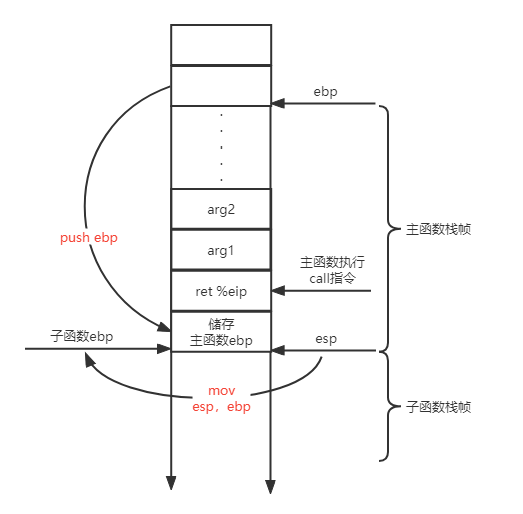

当子函数被主函数调用时，在主函数执行call指令之前，将子函数的参数从右到左入栈，并将当前eip入栈。子函数需要储存主函数的一些栈帧信息，只有这样，当子函数调用完成后才能返回到主函数调用子函数的那个位置。子函数开头两个指令为：

```assembly
push %ebp
mov %esp,%ebp
```

第一条指令目的是储存主函数的栈底。第二条指令目的是用ebp记录子函数的栈底。

子函数的栈底就是主函数的栈顶！

返回时，则操作相反：

```assembly
mov %ebp,%esp	//子函数的栈底就是主函数的栈顶
pop %ebp		//取出主函数的栈底位置
ret				//从当前位置获得主函数的eip
```


### stab表是什么？

GCC把C语言源文件( ‘.c’ )编译成汇编语言文件( ‘.s’ ), 汇编器把汇编语言文件翻译成目标文件( ‘.o’ )。在目标文件中, 调试信息用 ‘.stab’ 打头的一类汇编指导命令表示, 这种调试信息格式叫’Stab’, 即符号表(Symbol table)。这些调试信息包括行号、变量的类型和作用域、函数名字、函数参数和函数的作用域等源文件的特性。

# 参考资料

[MIT 6.828 JOS 操作系统学习笔记 - 随笔分类 - fatsheep9146 - 博客园 (cnblogs.com)](https://www.cnblogs.com/fatsheep9146/category/769143.html)

[MIT-6.828-JOS-lab1:C, Assembly, Tools, and Bootstrapping - gatsby123 - 博客园 (cnblogs.com)](https://www.cnblogs.com/gatsby123/p/9759153.html)


# MIT6.828——LAB2：memory management

# Part1：Physical Page Management

内存管理两个组件：

1. 物理内存分配器：pages（4096B）
2. 虚拟内存：将内核和用户软件使用的虚拟地址映射到物理内存中的地址

```c++
/*
 * Virtual memory map:                                Permissions
 *                                                    kernel/user
 *
 *    4 Gig -------->  +------------------------------+
 *                     |                              | RW/--
 *                     ~~~~~~~~~~~~~~~~~~~~~~~~~~~~~~~~
 *                     :              .               :
 *                     :              .               :
 *                     :              .               :
 *                     |~~~~~~~~~~~~~~~~~~~~~~~~~~~~~~| RW/--
 *                     |                              | RW/--
 *                     |   Remapped Physical Memory   | RW/--
 *                     |                              | RW/--
 *    KERNBASE, ---->  +------------------------------+ 0xf0000000    --+
 *    KSTACKTOP        |     CPU0's Kernel Stack      | RW/--  KSTKSIZE |
 *                     | - - - - - - - - - - - - - - -|                 |
 *                     |      Invalid Memory (*)      | --/--  KSTKGAP  |
 *                     +------------------------------+                 |
 *                     |     CPU1's Kernel Stack      | RW/--  KSTKSIZE |
 *                     | - - - - - - - - - - - - - - -|               PTSIZE
 *                     |      Invalid Memory (*)      | --/--  KSTKGAP  |
 *                     +------------------------------+                 |
 *                     :              .               :                 |
 *                     :              .               :                 |
 *    MMIOLIM ------>  +------------------------------+ 0xefc00000    --+
 *                     |       Memory-mapped I/O      | RW/--  PTSIZE
 * ULIM, MMIOBASE -->  +------------------------------+ 0xef800000
 *                     |  Cur. Page Table (User R-)   | R-/R-  PTSIZE
 *    UVPT      ---->  +------------------------------+ 0xef400000
 *                     |          RO PAGES            | R-/R-  PTSIZE
 *    UPAGES    ---->  +------------------------------+ 0xef000000
 *                     |           RO ENVS            | R-/R-  PTSIZE
 * UTOP,UENVS ------>  +------------------------------+ 0xeec00000
 * UXSTACKTOP -/       |     User Exception Stack     | RW/RW  PGSIZE
 *                     +------------------------------+ 0xeebff000
 *                     |       Empty Memory (*)       | --/--  PGSIZE
 *    USTACKTOP  --->  +------------------------------+ 0xeebfe000
 *                     |      Normal User Stack       | RW/RW  PGSIZE
 *                     +------------------------------+ 0xeebfd000
 *                     |                              |
 *                     |                              |
 *                     ~~~~~~~~~~~~~~~~~~~~~~~~~~~~~~~~
 *                     .                              .
 *                     .                              .
 *                     .                              .
 *                     |~~~~~~~~~~~~~~~~~~~~~~~~~~~~~~|
 *                     |     Program Data & Heap      |
 *    UTEXT -------->  +------------------------------+ 0x00800000
 *    PFTEMP ------->  |       Empty Memory (*)       |        PTSIZE
 *                     |                              |
 *    UTEMP -------->  +------------------------------+ 0x00400000    --+
 *                     |       Empty Memory (*)       |                 |
 *                     | - - - - - - - - - - - - - - -|                 |
 *                     |  User STAB Data (optional)   |               PTSIZE
 *    USTABDATA ---->  +------------------------------+ 0x00200000      |
 *                     |       Empty Memory (*)       |                 |
 *    0 ------------>  +------------------------------+               --+
 *
 * (*) Note: The kernel ensures that "Invalid Memory" is *never* mapped.
 *     "Empty Memory" is normally unmapped, but user programs may map pages
 *     there if desired.  JOS user programs map pages temporarily at UTEMP.
 */
```


`boot_alloc(uint32_t n)`：在物理地址上，从空闲位置开始分配n个字节（需要与PGSIZE对齐）,不进行初始化。

```c
static void *
boot_alloc(uint32_t n)
{
	static char *nextfree; // virtual address of next byte of free memory
	char *result;
    
	if (!nextfree)
	{
		extern char end[];
		nextfree = ROUNDUP((char *)end, PGSIZE);
	}
	// LAB 2: Your code here.
	if (n == 0)
		return nextfree;
	result = nextfree;
	nextfree = ROUNDUP(nextfree + n, PGSIZE);
	if ((uint32_t)nextfree - KERNBASE > (npages * PGSIZE))
		panic("Out of memory!\n");
	return result;
}
```

`mem_init(void)`函数：

1. 首先调用`i386_detect_memory`函数，其功能是检测现在系统中有多少可用的内存空间。

   

2. `kern_pgdir = (pde_t *) boot_alloc(PGSIZE)`

   `memset(kern_pgdir, 0, PGSIZE)`

   分配一个页，作为内核的页目录表，`kern_pgdir`是虚拟地址，并将此页初始化为0。

   

3. `kern_pgdir[PDX(UVPT)] = PADDR(kern_pgdir) | PTE_U | PTE_P`

   `UVPT`是虚拟地址，存放的是内核页表，因此，需要在此位置上添加一个映射：将`kern_pgdir`这个虚拟地址映射到实际的物理地址上，并且添加权限：内核与用户只读。

   ```c++
   // A linear address 'la' has a three-part structure as follows:
   //
   // +--------10------+-------10-------+---------12----------+
   // | Page Directory |   Page Table   | Offset within Page  |
   // |      Index     |      Index     |                     |
   // +----------------+----------------+---------------------+
   //  \--- PDX(la) --/ \--- PTX(la) --/ \---- PGOFF(la) ----/
   //  \---------- PGNUM(la) ----------/
   //
   // The PDX, PTX, PGOFF, and PGNUM macros decompose linear addresses as shown.
   // To construct a linear address la from PDX(la), PTX(la), and PGOFF(la),
   // use PGADDR(PDX(la), PTX(la), PGOFF(la)).
   ```

   执行以上代码后的物理内存布局如下：

   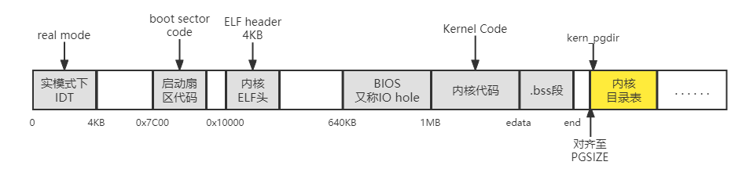

4. `pages = (struct PageInfo*)boot_alloc(sizeof(struct PageInfo)*npages)`
   `memset(pages, 0, sizeof(struct PageInfo)*npages)`

   `npages`表示可以分配多少页，每一页都需要使用`struct PageInfo`结构进行记录（包括了指向下一页的指针和当前页引用次数）。因此，需要分配足够的内存空间保存`pages数组`，`pages数组`的每一项是一个`PageInfo`结构，对应一个物理页的信息。

   执行以上代码后的物理内存布局如下：

   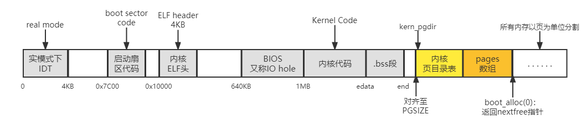

5. `page_init（）`

   初始化pages数组，初始化`page_free_list`，但是某些页不能被使用，需要修改其状态。

   下图为物理地址page使用的分布情况：

   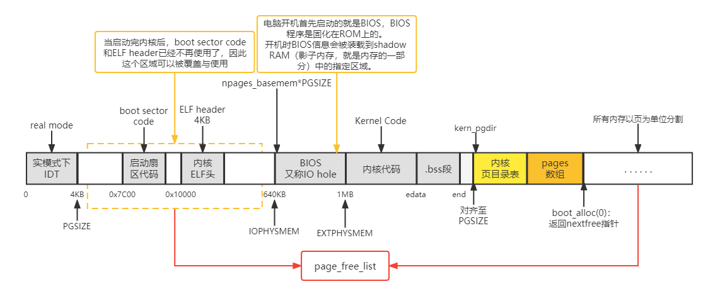

```c
//根据上面的图以及源代码中的提示，很容易就写出来了
void page_init(void)
{
	size_t i;
	pages[0].pp_ref = 1;
	pages[0].pp_link = NULL;
	for (i = 1; i < npages_basemem; ++i)
	{
		pages[i].pp_ref = 0;
		//头插法
		pages[i].pp_link = page_free_list;
		page_free_list = &pages[i];
	}

	size_t io_hole_end = EXTPHYSMEM / PGSIZE;
	for (; i < io_hole_end; ++i)
	{
		pages[i].pp_ref = 1;
		pages[i].pp_link = NULL;
	}

	//nextfree就是下一个free page
	//调用boot_alloc(0)，可返回其虚拟指针
	size_t next_free_page = PADDR(boot_alloc(0)) / PGSIZE;
	for (; i < next_free_page; ++i)
	{
		pages[i].pp_ref = 1;
		pages[i].pp_link = NULL;
	}

	for (; i < npages; ++i)
	{
		pages[i].pp_ref = 0;
		//头插法
		pages[i].pp_link = page_free_list;
		page_free_list = &pages[i];
	}
}
```

**`mem_init(void)`函数之后的流程请看part2**


`page_alloc(int alloc_flags)`和`page_free(struct PageInfo *pp)`比较简单，按照提示即可完成。

## 总结一下

part1总共写了五个函，从名字来说可以分三类，boot，memory和page层面。

- boot，启动层面，`boot_alloc() `在启动时可分配N个byte空间。通过调用这个函数，可以将物理内存分割成多个页。
- memory，内存层面，`mem_init() `通过调用`boot_alloc() `获得npage*sizeof(Page_Info)个byte的页面，也就是npages个页面。并使用数据结构`PageInfo`来记录所有的页。
- page，页面层面，`page_init()`是页面的初始化，初始化做的就是标记页表中哪些可以用，哪些不能用，把能用的链接起来。`page_alloc( )`就是分配这些能用的页面，`page_free（）`就是释放掉页面。

所以，part1基本就完成了内存层面初始化页面以及页面的基本操作（包括删除和分配）。


# Part2：Virtual Memory

### 虚拟地址、逻辑地址、线性地址、物理地址的区别：

段⻚式内存管理实现的⽅式： 

先将程序划分为多个有逻辑意义的段，也就是前⾯提到的分段机制； 

接着再把每个段划分为多个⻚，也就是对分段划分出来的连续空间，再划分固定⼤⼩的⻚；

这样，地址结构就由段号、段内⻚号和⻚内位移三部分组成

由此，**逻辑地址**是由段+偏移量组成，逻辑地址与虚拟地址没有明确分别，**虚拟地址（逻辑地址）**从段号到页号的翻译成为**线性地址**，然后线性地址通过页号+页内位移翻译成**物理地址**


| 名词     | 说明                                                         |
| -------- | ------------------------------------------------------------ |
| 页目录表 | 存放各个页目录项的表，页目录常驻内存，页目录表的物理地址存在寄存器CR3中 |
| 页目录项 | 存放各个二级页表起始物理地址，即页表页                       |
| 二级页表 | 存放页表项                                                   |
| 页表项   | 页表项的高20位存放各页的对应的物理地址的高20位               |

`pgdir_walk(pde_t *pgdir, const void *va, int create)`：

**给定一个页目录表指针 pgdir ，该函数应该返回线性地址va所对应的页表项指针（page table entry，PTE），不存在则根据create参数决定是否创建**

```c
// A linear address 'la' has a three-part structure as follows:
//
// +--------10------+-------10-------+---------12----------+
// | Page Directory |   Page Table   | Offset within Page  |
// |      Index     |      Index     |                     |
// +----------------+----------------+---------------------+
//  \--- PDX(la) --/ \--- PTX(la) --/ \---- PGOFF(la) ----/
//  \---------- PGNUM(la) ----------/
//
// The PDX, PTX, PGOFF, and PGNUM macros decompose linear addresses as shown.
// To construct a linear address la from PDX(la), PTX(la), and PGOFF(la),
// use PGADDR(PDX(la), PTX(la), PGOFF(la)).
```

```c
pte_t *
pgdir_walk(pde_t *pgdir, const void *va, int create)
{
	pde_t *va_dir_entry = &pgdir[PDX(va)];//获得页目录项物理地址
	if (!(*va_dir_entry & PTE_P))//如果不存在
	{
		if (!create)//不需要创建
			return NULL;
		struct PageInfo *pp = page_alloc(ALLOC_ZERO);//需要创建，则分配一页作为页表
		if (pp == NULL)
			return NULL;
		pp->pp_ref++;
		*va_dir_entry = page2pa(pp) | PTE_U | PTE_P | PTE_W;//将页表的物理地址和权限写入页目录项指针
    }		//	   转化为虚拟地址（获得PPN）			+ 页表偏移量=va对应的页表项指针
	return (pte_t *)KADDR(PTE_ADDR(*va_dir_entry)) + PTX(va);
}
```

代码流程图：

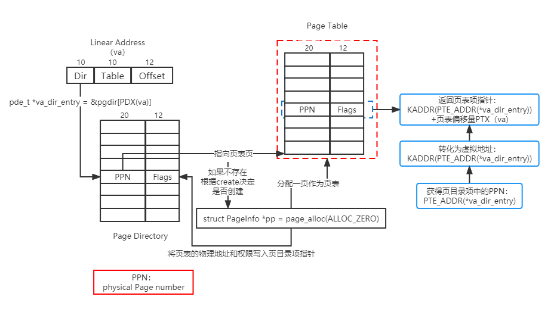

`boot_map_region(pde_t *pgdir, uintptr_t va, size_t size, physaddr_t pa, int perm)`：

**把虚拟地址空间范围[va, va+size)映射到物理空间[pa, pa+size)的映射关系加入到页目录表pgdir中**

```c
static void
boot_map_region(pde_t *pgdir, uintptr_t va, size_t size, physaddr_t pa, int perm)
{
	// Fill this function in
	size_t pgs = size / PGSIZE;
	if (size % PGSIZE != 0)
		pgs++;//	总共需要映射的页数
	for (int i = 0; i < pgs; ++i)
	{
		pte_t *pg_table_entry = pgdir_walk(pgdir, (void *)va, 1);//获得va对应的页表项指针
		if (pg_table_entry == NULL)
		{
			panic("no enough memory to allocate for page!");
			return;
		}
		*pg_table_entry = pa | perm | PTE_P;//将页表项指针指向物理地址pa并赋予权限。完成映射！
		pa += PGSIZE;//映射下一页
		va += PGSIZE;
	}
}
```

`page_insert(pde_t *pgdir, struct PageInfo *pp, void *va, int perm)`：

**把一个物理页pp与虚拟地址va建立映射关系**

```c
int page_insert(pde_t *pgdir, struct PageInfo *pp, void *va, int perm)
{
	// Fill this function in
	pte_t *pg_table_entry = pgdir_walk(pgdir, va, 1);
	if (pg_table_entry == NULL)
		return -E_NO_MEM;
	if (*pg_table_entry & PTE_P)//此页表项是否已被映射
	{
		if (PTE_ADDR(*pg_table_entry) == page2pa(pp))//映射的是否就是pp
		{
			*pg_table_entry = page2pa(pp) | perm | PTE_P;//如果是，只需修改权限
			return 0;
		}
		page_remove(pgdir, va);//如果不是，则需要先移除此映射
	}
	pp->pp_ref++;
	*pg_table_entry = page2pa(pp) | PTE_P | perm;
	pgdir[PDX(va)] |= perm;//更新页目录项的权限
	return 0;
}
```

`page_lookup(pde_t *pgdir, void *va, pte_t **pte_store)`：

**返回虚拟地址va所映射的物理页的PageInfo结构体的指针，如果pte_store参数不为0，则把这个物理页的页表项地址存放在pte_store中**

```c
struct PageInfo *
page_lookup(pde_t *pgdir, void *va, pte_t **pte_store)
{
	// Fill this function in
	pte_t *pg_table_entry = pgdir_walk(pgdir, va, 0);//查找对应的页表项
	//	没有被映射				或	映射地址无效
    if (pg_table_entry == NULL || !(*pg_table_entry & PTE_P))
		return NULL;
	if (pte_store != NULL)
		*pte_store = pg_table_entry;
	return pa2page(PTE_ADDR(*pg_table_entry));返回页表项的PPN
}
```

`page_remove(pde_t *pgdir, void *va)`：

**把虚拟地址va和物理页的映射关系删除**

```c
void page_remove(pde_t *pgdir, void *va)
{
	// Fill this function in
	pte_t *pg_table_entry = NULL;
	struct PageInfo *pp = page_lookup(pgdir, va, &pg_table_entry);
	if (pp == NULL)//如果是NULL，说明已经没有被映射了或者映射无效了，可直接返回
		return;
	page_decref(pp);//释放pp物理页
	tlb_invalidate(pgdir, va);//刷新TLB
	*va_table_entry = 0;
}
```

TLB：缓存常访问的页表或页目录

## 总结一下

part2主要工作就是建立虚拟内存与物理内存的映射，包括了查找虚拟地址对应的页表项

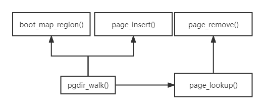

# Part3：Kernel Address Space

`ULIM`以上的地址空间只能被内核读写，用户不可读写

`[UTOP,ULIM]`之间的空间可以同时被内核和用户读取，但都不能修改，主要包括了页目录表、pages数组、envs数组（下一个lab）

`UTOP`以上为内核空间，其以下的空间给用户进程使用，用户可以读写

继续mem_init(void)函数：

6. `boot_map_region(kern_pgdir, UPAGES, PTSIZE, PADDR(pages), PTE_U)`

   通过kern_pgdir将物理地址上的pages数组映射到虚拟地址UPAGES处，并设置权限：用户只读

7. `boot_map_region(kern_pgdir, KSTACKTOP - KSTKSIZE, KSTKSIZE, PADDR(bootstack), PTE_W)`

   把由bootstack变量所标记的物理地址范围映射给内核的堆栈，`bootstack`定义在/kernel/entry.S中，但是还是不太明白bootstack所指向的物理地址在哪，没找到。

8. `boot_map_region(kern_pgdir, KERNBASE, 0xffffffff - KERNBASE, 0, PTE_W)`：

   最后将KERNBASE以上的虚拟内存全部映射，虚拟地址范围是[KERNBASE, 2^32]，物理地址范围是[0，2^32 - KERNBASE]；物理地址可能没有`2^32 - KERNBASE`那么多，但依然映射

9. `lcr3(PADDR(kern_pgdir))`：

   将kern_pgdir加载进CR3寄存器

执行完mem_init()后，虚拟地址到物理地址的映射图：

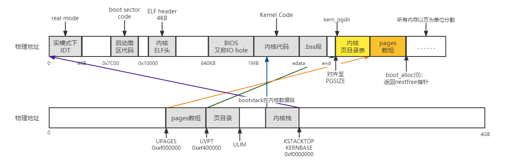


# 参考资料

[MIT 6.828 JOS学习笔记15. Lab 2.1 - fatsheep9146 - 博客园 (cnblogs.com)](https://www.cnblogs.com/fatsheep9146/p/5124921.html)

[MIT-6.828-JOS-lab2:Memory management - gatsby123 - 博客园 (cnblogs.com)](https://www.cnblogs.com/gatsby123/p/9832223.html)


# MIT6.828——lab3:User Environment

主要介绍JOS中的进程，异常处理，系统调用。内容上分为三部分：

1. 用户环境建立，可以加载用户ELF文件并执行。（目前还没有文件系统，需要在内核代码硬编码需要加载的用户程序）
2. 建立异常处理机制，异常发生时能从用户态进入内核进行处理，然后返回用户态。
3. 借助异常处理机制，提供系统调用的能力。

# Part A: User Environments and Exception Handling

`kern/env.c `：

```c
struct Env *envs = NULL;		  // All environments
struct Env *curenv = NULL;		  // The current env
static struct Env *env_free_list; // Free environment list
								  // (linked by Env->env_link)
```

## Environment Status

```c
struct Env {
	struct Trapframe env_tf;	// Saved registers
	struct Env *env_link;		// Next free Env
	envid_t env_id;			// Unique environment identifier
	envid_t env_parent_id;		// env_id of this env's parent
	enum EnvType env_type;		// Indicates special system environments
	unsigned env_status;		// Status of the environment
	uint32_t env_runs;		// Number of times environment has run

	// Address space
	pde_t *env_pgdir;		// Kernel virtual address of page dir
};
```

`env_tf`:
　　这个类型的结构体在inc/trap.h文件中被定义，里面存放着当用户环境暂停运行时，所有重要寄存器的值。内核也会在系统从用户态切换到内核态时保存这些值，这样的话用户环境可以在之后被恢复，继续执行。

`env_link`:
　　这个指针指向env_free_list，该链表的第一个free的Env结构体。

`env_id`:
　　这个值可以唯一的确定使用这个结构体的用户环境是什么。当这个用户环境终止，内核会把这个结构体分配给另外一个不同的环境，这个新的环境会有不同的env_id值。

`env_parent_id`:
　　创建这个用户环境的父用户环境的env_id

`env_type`:
　　用于区别出来某个特定的用户环境。对于大多数环境来说，它的值都是 ENV_TYPE_USER.

`env_status`:
　　这个变量存放以下可能的值
　　ENV_FREE: 代表这个结构体是不活跃的，应该在链表env_free_list中。
　　ENV_RUNNABLE: 代表这个结构体对应的用户环境已经就绪，等待被分配处理机。
　　ENV_RUNNING: 代表这个结构体对应的用户环境正在运行。
　　ENV_NOT_RUNNABLE: 代表这个结构体所代表的是一个活跃的用户环境，但是它不能被调度运行，因为它在等待其他环境传递给它的消息。
　　ENV_DYING: 代表这个结构体对应的是一个僵尸环境。一个僵尸环境在下一次陷入内核时会被释放回收。

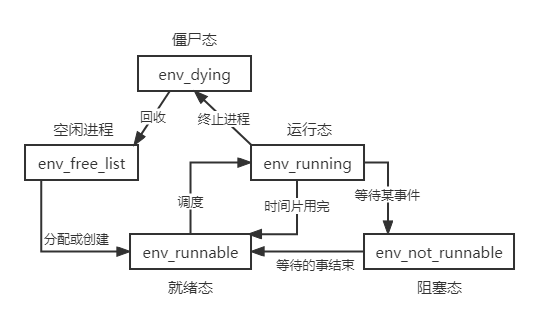

env_pgdir:
　　这个变量存放着这个环境的页目录的虚拟地址

## Allocating the Environments Array

在mem_init()函数中初始化envs数组，与lab2中初始化pages数组基本一样：

```c
envs = (struct Env *)boot_alloc(sizeof(struct Env) * NENV);
memset(envs, 0, sizeof(struct Env) * NENV);
```

在物理地址上分配`NENV`个`struct Env`结构的空间，并用`envs`指针指向起始位置，初始化为零。

`envs数组`表示可创建的最大进程数，`env_free_list`指向的是还可以创建的进程数

```c
boot_map_region(kern_pgdir, UENVS, PTSIZE, PADDR(envs), PTE_U);
```

将虚拟地址`UENVS`和物理地址`envs`进行映射，大小为PTSIZE，并将映射关系写入`kern_pgdir`中

执行完以上代码后，虚拟地址到物理地址映射关系如下：

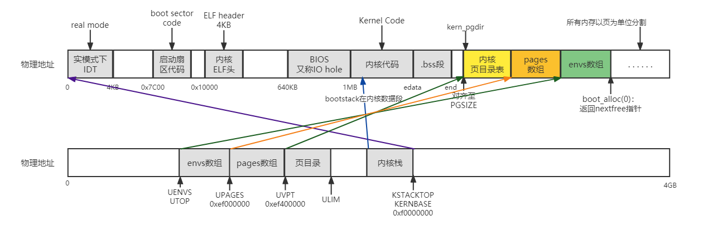

## Creating and Running Environments

完成`kern/env.c`下的函数：

#### `env_init(void)`：

**初始化envs数组，将envs数组构建成env_free_list链表，注意顺序，envs[0]应该在链表头部位置**

```c
void env_init(void)
{
	int i;
	env_free_list = NULL;
	for (i = NENV - 1; i >= 0; --i)
	{
		envs[i].env_id = 0;
		envs[i].env_status = ENV_FREE;
		envs[i].env_link = env_free_list;
		env_free_list = &envs[i];
	}

	// Per-CPU part of the initialization
	env_init_percpu();
}
```

示意图：

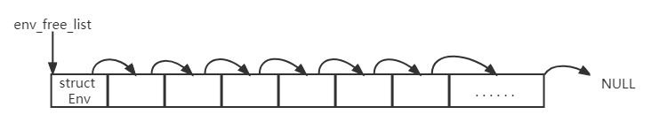


#### `env_setup_vm(struct Env *e)`：

**初始化e指向的Env结构代表的用户环境的页目录表，设置e->env_pgdir字段**

这个函数就是设置用户环境的虚拟地址到物理地址的映射。在上一个lab中，我们设置了内核空间的虚拟地址到物理地址的映射。用户环境与内核空间的设置方法是一致的，唯一的区别在于页目录不一样。

每个进程（内核也是一个进程）都有属于自己的页目录，因此，在这个函数中，需要修改目录表，其他的与内核空间的一致。

```c
static int
env_setup_vm(struct Env *e)
{
	int i;
	struct PageInfo *p = NULL;

	// Allocate a page for the page directory
	if (!(p = page_alloc(ALLOC_ZERO)))
		return -E_NO_MEM;

	e->env_pgdir = (pte_t *)page2kva(p);
	p->pp_ref++;//UTOP以上的被映射的物理页是不需要pp_ref的，因为这些物理页是必须被使用的。而env_pgdir会随着进程的结束而释放（kern_pgdir不能被释放）

	for (i = 0; i < PDX(UTOP); ++i)
		e->env_pgdir[i] = 0;
    					//一页page directory的页目录项数
	for (i = PDX(UTOP); i < NPDENTRIES; ++i)
		e->env_pgdir[i] = kern_pgdir[i];

	// UVPT maps the env's own page table read-only.
	// Permissions: kernel R, user R
	e->env_pgdir[PDX(UVPT)] = PADDR(e->env_pgdir) | PTE_P | PTE_U;

	return 0;
}
```


#### `region_alloc(struct Env *e, void *va, size_t len)`：

**在进程e中，为[va,va+len]分配物理空间，并将映射关系写入`env_pgdir`**

```c
static void
region_alloc(struct Env *e, void *va, size_t len)
{
	void *begin = ROUNDDOWN(va, PGSIZE);//需要进行页对齐
	void *end = ROUNDUP(va + len, PGSIZE);
	while (begin < end)
	{
		struct PageInfo *pg = page_alloc(0);//获得一个物理页，不用置零
		if (pg == NULL)
			panic("page allocation failed!");
		page_insert(e->env_pgdir, pg, begin, PTE_W | PTE_U);//添加映射关系
		begin += PGSIZE;
	}
}
```


#### `load_icode(struct Env *e, uint8_t *binary)`：

**内核想要运行一个用户进程是需要执行一个程序的，因此为进程e加载binary地址开始处的ELF文件**

##### ELF文件结构描述

|               ELF HEADER                |
| :-------------------------------------: |
|                  .test                  |
|                  .data                  |
|                  .bss                   |
|           ... other sections            |
|          section header table           |
| string tables       symbol tables   ... |

##### 文件头（ELF HEADER）

| 成员        | readelf输出结果                                              |
| ----------- | ------------------------------------------------------------ |
| e_ident     | Magic:    Class:    Data:    Version:    OS/ABI    ABI Version: |
| e_type      | Type:                                                        |
| e_machine   | Machine:                                                     |
| e_version   | Version:                                                     |
| e_entry     | Entery point address:ELF程序的入口虚拟地址。可重定位文件一般没有，值为0 |
| e_phoff     | Start of program headers:                                    |
| e_shoff     | Start of section headers:                                    |
| e_flags     | Flages:                                                      |
| e_ehsize    | Size of this header:                                         |
| e_phentsize | Size of program headers:                                     |
| e_phnum     | Number of program headers:                                   |
| e_shentsize | Size of section headers:段表描述符大小                       |
| e_shnum     | Number of section headers:段表描述符数量                     |
| e_shstrndx  | Section header string table index:段表字符串表所在的段在段表中的下标 |

**Segment**概念是从装载（从磁盘加载到内存中）的角度重新划分了ELF的各个段（Section），将目标文件链接成可执行文件的时候，连接器会尽量把相同**权限属性**的段分配在同一空间

**Section**是从链接角度划（**数据属性**）分ELF：比如划分为代码段、数据段、.bss段

描述`Section`的结构叫做段表（section header）

描述`Segment`的结构叫程序头（program header）：ELF可执行文件有程序头表（Program Header Table）描述了ELF文件该如何被操作系统映射到进程的虚拟空间，其结构体如下：

```c
typedef struct {
    Elf32_Word 	p_type;		//segment类型，只关注“LOAD”类型
    Elf32_Off 	p_offset;	//segment在elf文件中的偏移
    Elf32_Addr 	p_vaddr;	//segment的第一个字节在虚拟地址空间的起始位置
    Elf32_Addr	p_paddr;	//segment的物理装载地址
    Elf32_Word	p_filesz;	//segment在ELF文件中所占空间长度
    Elf32_Word	p_memsz;	//segment在虚拟地址空间中所占长度
    Elf32_Word	p_flags;	//segment权限属性
    Elf32_Word	p_align;	//segment对齐属性
}Elf32_Phdr
```

```c
static void
load_icode(struct Env *e, uint8_t *binary)
{
	struct Elf *header = (struct Elf *)binary;
	if (header->e_magic != ELF_MAGIC)
		panic("load_icode failed:the binary is not elf.\n");
	if (header->e_entry == 0)
		panic("load_icode failed:the elf can't be excuted.\n");
	
    //进程e起始指令地址就是header的入口
	e->env_tf.tf_eip = header->e_entry;

    //segment的结构——program header
	struct Proghdr *ph = (struct Proghdr *)((uint8_t *)header + header->e_phoff);
	int ph_num = header->e_phnum;//Number of program headers
	
    //此时是内核初始化用户进程，为内核页目录表，加载进程e的页目录表从而实现地址映射
	lcr3(PADDR(e->env_pgdir)); //加载用户空间页目录

	int i;
	for (i = 0; i < ph_num; ++i)
	{
		if (ph[i].p_type == ELF_PROG_LOAD)
		{
			if (ph[i].p_memsz < ph[i].p_filesz)
				panic("load_icode failed:p_memsz<p_filesz.\n");
            //为每一个segment分配一个物理页
			region_alloc(e, (void *)ph[i].p_va, ph[i].p_memsz);
			memset((void *)ph[i].p_va, 0, ph[i].p_memsz);
            //将segment从elf中装载到虚拟地址上		segment在elf文件中的偏移
			memcpy((void *)ph[i].p_va, binary + ph[i].p_offset, ph[i].p_filesz);
		}
	}
	//设置完成后，需要重新载入kern_pgdir，因为此时还是在内核态下
	lcr3(PADDR(kern_pgdir));
	
    //为进程e分配一个大小为PGSIZE的物理页作为stack
	region_alloc(e, (void *)(USTACKTOP - PGSIZE), PGSIZE);
}
```


#### `env_create(uint8_t *binary, enum EnvType type)`：

**从env_free_list链表拿一个Env结构，加载从binary地址开始处的ELF可执行文件到该Env结构**

```c
void env_create(uint8_t *binary, enum EnvType type)
{
	// LAB 3: Your code here.
	struct Env *e;
	if (env_alloc(&e, 0) != 0)
		panic("env_create failed: env_alloc failed.\n");
	load_icode(e, binary);
	e->env_type = type;
}
```


#### `env_run(struct Env *e)`：

**执行进程e**

进程上下文切换是在内核中进行的，而用户态需要通过系统调用或中断到内核态。则在进入内核态之前就需要保存用户态的各类寄存器值，因此，`env_run()`函数（用户进入内核，内核再调用该函数）中，上下文切换时，不需要再保存进程curenv的寄存器值

```c
void env_run(struct Env *e)
{
	if (curenv != NULL && curenv->env_status == ENV_RUNNING)
		curenv->env_status = ENV_RUNNABLE;
	curenv = e;
	e->env_status = ENV_RUNNING;
	e->env_runs++;
	lcr3(PADDR(e->env_pgdir));
    //将进程e的各类寄存器值加载到各类寄存器中
    //至于当前进程（希望调用env_run()函数的进程）寄存器值在进入内核态之前会被保存
	env_pop_tf(&e->env_tf);

	panic("env_run not yet implemented");
}
```

用户环境的代码被调用前，操作系统一共按顺序执行了以下几个函数：

start (kern/entry.S)

---->i386_init (kern/init.c)

​		---->cons_init

　　---->mem_init

　　---->env_init

　　---->trap_init （目前还未实现）

　　---->env_create

　　---->env_run

　　---->env_pop_tf

目前，trap_init还未实现，当用户调用`iret`指令进行系统调用时不能成功。当CPU发现失败时会触发一个保护异常，保护异常也无法处理，从而产生一个错误异常，仍然无法解决问题，最后放弃，此种情况称为“triple fault”

## Handling Interrupts and Exceptions

### Basics of Protected Control Transfer

一个**中断**指的是由外部异步事件引起的处理器控制权转移，比如外部IO设备发送来的中断信号。

一个**异常**则是由于当前正在运行的指令所带来的同步的处理器控制权的转移，比如除零溢出异常。

中断或异常发生时，不能由用户随意选择进入内核的位置。因此，提供两种机制使得当中断或异常发生时能从指定位置进入内核：

1. **中断向量表(Interrupt Descriptor Table，IDT)：**通过中断向量表选择处理程序，并加载到`CS`和`EIP`寄存器，从而运行处理程序。

   处理器保证中断和异常只能够引起内核进入到一些特定的，被事先定义好的程序入口点，而不是由触发中断的程序来决定中断程序入口点。
   　　X86允许多达256个不同的中断和异常，每一个都配备一个独一无二的中断向量。一个向量指的就是0到255中的一个数。一个中断向量的值是根据中断源来决定的：不同设备，错误条件，以及对内核的请求都会产生出不同的中断和中断向量的组合。CPU将使用这个向量作为这个中断在中断向量表中的索引，这个表是由内核设置的，放在内核空间中，和GDT很像。通过这个表中的任意一个表项，处理器可以知道：
   　　*需要加载到EIP寄存器中的值，这个值指向了处理这个中断的中断处理程序的位置。
   　　*需要加载到CS寄存器中的值，里面还包含了这个中断处理程序的运行特权级。（即这个程序是在用户态还是内核态下运行。）

2. **任务状态段(Task State Segment，TSS)：**

   处理器还需要一个地方来存放，当异常/中断发生时，处理器的状态，比如EIP和CS寄存器的值。这样的话，中断处理程序一会可以重新返回到原来的程序中。这段内存自然也要保护起来，不能被用户态的程序所篡改。

   正因为如此，当一个x86处理器要处理一个中断或异常并且使运行特权级从用户态转为内核态时，它也会把它的堆栈切换到内核空间中。一个叫做 “任务状态段（TSS）”的数据结构将会详细记录这个堆栈所在的段的段描述符和地址。处理器会把SS，ESP，EFLAGS，CS，EIP以及一个可选错误码等等这些值压入到这个堆栈上。然后加载中断处理程序的CS，EIP值，并且设置ESP，SS寄存器指向新的堆栈。
   尽管TSS非常大，并且还有很多其他的功能，但是JOS仅仅使用它来定义处理器从用户态转向内核态所采用的内核堆栈，由于JOS中的内核态指的就是特权级0，所以**处理器用TSS中的ESP0，SS0字段来指明这个内核堆栈的位置，大小。**

### Types of Exceptions and Interrupts

​		所有的由X86处理器内部产生的异常的向量值是0到31之间的整数。比如，`page fault`所对应的向量值是14.而大于31号的中断向量对应的是软件中断，由`int指令`生成；外部中断，由外部设备生成。

### An Example

假设处理器正在用户状态下运行代码，但是遇到了一个除法指令，并且除数为0。

1. 处理器会首先切换堆栈，切换到由TSS的SS0，ESP0字段所指定的内核堆栈区，这两个字段分别存放着GD_KD和KSTACKTOP的值。

2. 处理器把异常参数（即需要保存的寄存器值）压入到内核堆栈中，起始于地址KSTACKTOP

   ```c
   +--------------------+ KSTACKTOP             
   | 0x00000 | old SS   |     " - 4	----|
   |      old ESP       |     " - 8	  	|切换堆栈，需要保存原来的堆栈以及标志
   |     old EFLAGS     |     " - 12	----|
   | 0x00000 | old CS   |     " - 16			----|
   |      old EIP       |     " - 20 <---- ESP ----|执行中断处理程序，需要保存原来的指令
   +--------------------+             
   ```

3. 除以0的异常中断号是0，处理器读取IDT的第0项，从中解析出CS:EIP。

4. CS:EIP处的异常处理函数执行。

   对于一些异常来说，除了压入上图五个值，还会压入错误代码，如下所示：

   ```c
                        +--------------------+ KSTACKTOP             
                        | 0x00000 | old SS   |     " - 4
                        |      old ESP       |     " - 8
                        |     old EFLAGS     |     " - 12
                        | 0x00000 | old CS   |     " - 16
                        |      old EIP       |     " - 20
                        |     error code     |     " - 24 <---- ESP
                        +--------------------+   
   ```

### Nested Exceptions and Interrupts

​		处理器在用户态下和内核态下都可以处理异常或中断。只有当处理器从用户态切换到内核态时，才会自动地切换堆栈，并且把一些寄存器中的原来的值压入到堆栈上，并且触发相应的中断处理函数。但如果处理器已经处在内核态下时，因为它不需要切换堆栈，所以它不需要存储SS，ESP寄存器的值：

```c
                     +--------------------+ <---- old ESP
                     |     old EFLAGS     |     " - 4
                     | 0x00000 | old CS   |     " - 8
                     |      old EIP       |     " - 12
                     +--------------------+             
```

与`trapframe`结构对比一下，可以发现压入的值和从下往上看的结构体中的值一样！

### Setting Up the IDT

```c
应该实现的整体控制流：

      IDT                   trapentry.S         trap.c
   
+----------------+                        
|   &handler1    |---------> handler1:          trap (struct Trapframe *tf)
|                |             // do stuff      {
|                |             call trap          // handle the exception/interrupt
|                |             // ...           }
+----------------+
|   &handler2    |--------> handler2:
|                |            // do stuff
|                |            call trap
|                |            // ...
+----------------+
       .
       .
       .
+----------------+
|   &handlerX    |--------> handlerX:
|                |             // do stuff
|                |             call trap
|                |             // ...
+----------------+
```

整个操作系统的中断控制流程为：

1. trap_init() 先将所有中断处理函数的起始地址放到中断向量表IDT中。

2. 当中断发生时，不管是外部中断还是内部中断，处理器捕捉到该中断，进入核心态

　　3. 保存被中断的程序的上下文到内核堆栈中（SS，ESP，EFLAGS，CS，EIP）
        　　4. 根据中断向量去查询中断向量表，找到对应的表项，调用这个表项中指明的中断处理函数。
                　　5. 执行中断处理函数。
        　　6. 执行完成后，恢复被中断的进程的上下文，返回用户态，继续运行这个进程。

在`trapentry.S`和`trap.c`中建立异常处理函数，在`trap_init()`中建立并且加载IDT。

```assembly
/*在trapentry.S中的代码*/

.text

/*
 * Lab 3: Your code here for generating entry points for the different traps.
 */
 /*这里实际上只是压入了tf_trapno，即中断向量，并没有实际的处理函数
  *后续是通过trap_dispatch()函数，根据压入的tf_trapno选择处理函数
  */
TRAPHANDLER_NOEC(divide_handler,T_DIVIDE)
TRAPHANDLER_NOEC(debug_handler,T_DEBUG)
TRAPHANDLER_NOEC(nmi_handler,T_NMI)
TRAPHANDLER_NOEC(brkpt_handler,T_BRKPT)
TRAPHANDLER_NOEC(oflow_handler,T_OFLOW)
TRAPHANDLER_NOEC(bound_handler,T_BOUND)
TRAPHANDLER_NOEC(illop_handler,T_ILLOP)
TRAPHANDLER_NOEC(device_handler,T_DEVICE)
TRAPHANDLER(dblflt_handler,T_DBLFLT)
TRAPHANDLER(tss_handler,T_TSS)
TRAPHANDLER(segnp_handler,T_SEGNP)
TRAPHANDLER(stack_handler,T_STACK)
TRAPHANDLER(gpflt_handler,T_GPFLT)
TRAPHANDLER(pgflt_handler,T_PGFLT)
TRAPHANDLER_NOEC(fperr_handler,T_FPERR)
TRAPHANDLER(align_handler,T_ALIGN)
TRAPHANDLER_NOEC(mchk_handler,T_MCHK)
TRAPHANDLER_NOEC(simderr_handler,T_SIMDERR)
TRAPHANDLER_NOEC(syscall_handler,T_SYSCALL)


/*
 * Lab 3: Your code here for _alltraps
 */
_alltraps:
/*保存上下文，根据trapframe结构，SS、ESP、EFLAGS、CS、EIP在之前便由处理器自动压入
 *在这里需要压入DS、ES以及其他通用寄存器的值
 */
	pushl %ds
	pushl %es
	pushal	/*压入tf_regs，即通用寄存器值，此时ESP指向这里，为Trapframe结构的起始地址*/

	movl $GD_KD, %eax	/*数据可以直接送入基本寄存器，但不能直接送入段寄存器*/
	movw %ax, %ds		/*切换到内核数据段*/
	movw %ax, %es

	push %esp			/*压入trap()的参数tf*/
	call trap			/*调用trap(struct Trapframe *tf)时
						 *将前面压入的值整体当作trapframe结构
						 */
```

### 梳理一下用户态到内核态的上下文切换压入过程：

​		由用户程序切换到内核，我们需要保存用户程序的各个寄存器信息，这些信息都被保存到用户程序的`Trapframe`里面

1. 用户态发出一个异常，此时，需要进入内核态进行处理

2. CPU首先切换堆栈（用户栈--->内核栈），怎么切换？

   通过TSS寄存器获得SS0和ESP0，这两个值描述了内核堆栈的位置，那么如何保存这两个值？

   当然是需要保存在SS寄存器和ESP寄存器中。因此，CPU需要先将用户态的SS与ESP压入到内核栈上，同时还要压入EFLAGS。

3. 因为要运行内核指令，所以CPU还需要压入用户态的CS和EIP

4. 接下来，通过中断向量在IDT中查找对应的中断处理函数，其trapno（中断值）由`TRAPHANDLER`或`TRAPHANDER_NOEC`这两个宏函数压入

5. 然后执行`_alltraps`，其作用就是压入剩下的寄存器：DS、ES以及`tf_regs`结构中的所有寄存器

6. 此时ESP会指向内核栈的栈顶，压入ESP，表示完成了`trapframe`结构的构建，这个会作为参数传递给`trap()`函数

7. 最后，`call trap`，此时，上下文已经切换完成了，可以调用`trap()`函数从而进入中断处理函数，进行处理了

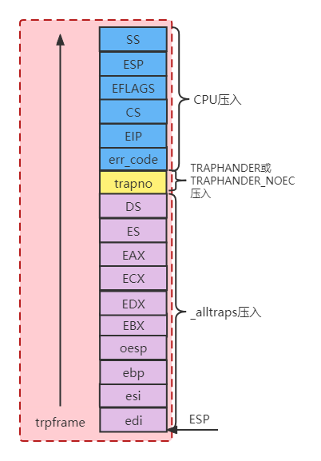

现在，已经设置好了中断处理函数，并且可以进行上下文切换了，但还没有建立IDT，因此，需要在`trap_init()`函数中进行IDT初始化：

```c
void divide_handler();
void debug_handler();
void nmi_handler();
void brkpt_handler();
void oflow_handler();
void bound_handler();
void illop_handler();
void device_handler();
void dblflt_handler();
void tss_handler();
void segnp_handler();
void stack_handler();
void gpflt_handler();
void pgflt_handler();
void fperr_handler();
void align_handler();
void mchk_handler();
void simderr_handler();
void syscall_handler();

void trap_init(void)
{
	extern struct Segdesc gdt[];

	// LAB 3: Your code here.
	SETGATE(idt[T_DIVIDE], 0, GD_KT, divide_handler, 0);
	SETGATE(idt[T_DEBUG], 0, GD_KT, debug_handler, 0);
	SETGATE(idt[T_NMI], 0, GD_KT, nmi_handler, 0);
	SETGATE(idt[T_BRKPT], 0, GD_KT, brkpt_handler, 3);
	SETGATE(idt[T_OFLOW], 0, GD_KT, oflow_handler, 0);
	SETGATE(idt[T_BOUND], 0, GD_KT, bound_handler, 0);
	SETGATE(idt[T_ILLOP], 0, GD_KT, illop_handler, 0);
	SETGATE(idt[T_DEVICE], 0, GD_KT, device_handler, 0);
	SETGATE(idt[T_DBLFLT], 0, GD_KT, dblflt_handler, 0);
	SETGATE(idt[T_TSS], 0, GD_KT, tss_handler, 0);
	SETGATE(idt[T_SEGNP], 0, GD_KT, segnp_handler, 0);
	SETGATE(idt[T_STACK], 0, GD_KT, stack_handler, 0);
	SETGATE(idt[T_GPFLT], 0, GD_KT, gpflt_handler, 0);
	SETGATE(idt[T_PGFLT], 0, GD_KT, pgflt_handler, 0);
	SETGATE(idt[T_FPERR], 0, GD_KT, fperr_handler, 0);
	SETGATE(idt[T_ALIGN], 0, GD_KT, align_handler, 0);
	SETGATE(idt[T_MCHK], 0, GD_KT, mchk_handler, 0);
	SETGATE(idt[T_SIMDERR], 0, GD_KT, simderr_handler, 0);
	SETGATE(idt[T_SYSCALL], 0, GD_KT, syscall_handler, 3);

	// Per-CPU setup
	trap_init_percpu();
}
```

`SETGATE`宏的定义：
　　#define SETGATE(gate, istrap, sel, off, dpl)
　　其中gate是idt表的index入口，istrap判断是异常还是中断，sel为代码段选择符，off表示对应的处理函数地址，dpl（Descriptor Privilege Level）表示触发该异常或中断的用户权限。`GD_KT`为内核代码段，每一个处理函数的地址是相对与内核代码段的偏移

​		IDT中的dpl设置为0或3有很大的区别：

- 设置为0，表示只能由内核调用，用于处理中断或异常（用户是被动的）
- 设置为3，表示可以由用户主动申请让内核进行调用，即syscall


# Part B: Page Faults, Breakpoints Exceptions, and System Calls

volatile提醒编译器它后面所定义的变量随时都有可能改变，因此编译后的程序每次需要存储或读取这个变量的时候，告诉编译器对该变量不做优化，都会直接从变量内存地址中读取数据，从而可以提供对特殊地址的稳定访问。

如果没有volatile关键字，则编译器可能优化读取和存储，可能暂时使用寄存器中的值，如果这个变量由别的程序更新了的话，将出现不一致的现象。（简洁的说就是：volatile关键词影响编译器编译的结果，用volatile声明的变量表示该变量随时可能发生变化，与该变量有关的运算，不要进行编译优化，以免出错）

const, volatile同时修饰一个变量

（1）合法性

​      “volatile”的含义并非是“non-const”，volatile 和 const 不构成反义词，所以可以放一起修饰一个变量。

（2）同时修饰一个变量的含义

​     表示一个变量在程序编译期不能被修改且不能被优化；在程序运行期，变量值可修改，但每次用到该变量的值都要从内存中读取，以防止意外错误。

**volatile一般用处：**

**1）并行设备的硬件寄存器（如：状态寄存器）**

**2）中断服务程序中修改的供其它程序检测的变量，需要加volatile；**

**3）多任务环境下各任务间共享的标志，应该加volatile；**

**4）存储器映射的硬件寄存器通常也要加volatile说明，因为每次对它的读写都可能由不同意义**

## Handling Page Fault

缺页中断——中断向量为14：当缺页中断发生时，系统会把引起中断的线性地址存放到控制寄存器 CR2 中

在`trap_dispatch()`函数中，添加`page_fault_hander()`函数，使得可以处理缺页异常

```c
switch (tf->tf_trapno)
	{
	case T_PGFLT:
		page_fault_handler(tf);
		break;
	}
```

从用户态进入内核态的中断处理过程：

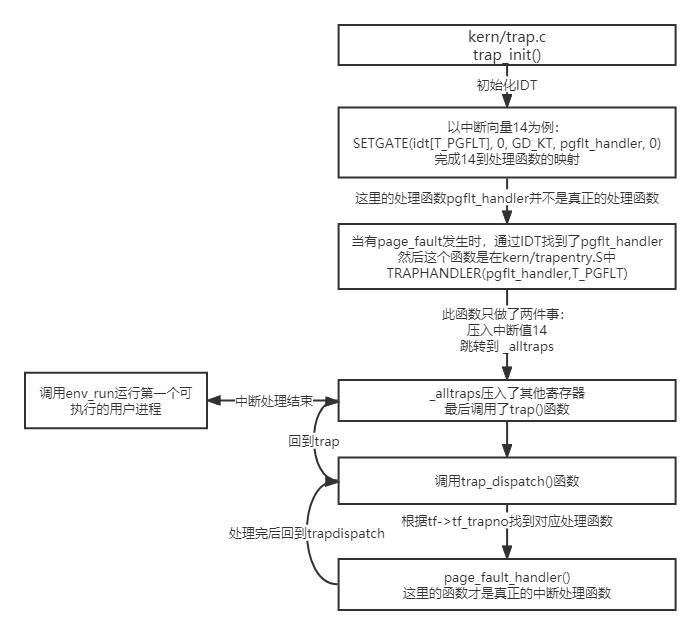

## Breaking Points Exception

断点异常，值为3，这个异常可以让调试器能够给程序加上断点。加断点的基本原理就是把要加断点的语句用一个 INT3 指令替换，执行到INT3时，会触发软中断。在JOS中，将通过把这个异常转换成一个伪系统调用，这样的话任何用户环境都可以使用这个伪系统调用来触发JOS kernel monitor。

在`trapdispatch()`函数中添加一个case：

```c
case T_BRKPT:
		monitor(tf);
```

## System Calls

应用程序会把系统调用号以及系统调用的参数放到寄存器中。通过这种方法，内核就不需要去查询用户程序的堆栈了。系统调用号存放到 %eax 中，参数则存放在 %edx, %ecx, %ebx, %edi, 和 %esi 中。内核会把返回值送到 %eax中。

中断、异常、系统调用都是使用同一个机制，只是用处不一样，因而叫法不一样。

为中断向量T_SYSCALL（其值为48）编写一个中断处理函数：

```c
//在kern/trapentry.S中添加
TRAPHANDLER_NOEC(syscall_handler,T_SYSCALL)
    
//在kern/trap.c的trap_init()函数中添加
void syscall_handler();
SETGATE(idt[T_SYSCALL], 0, GD_KT, syscall_handler, 3);

//在kern/trap.c的trap_dispatch()函数中添加
case T_SYSCALL:
		tf->tf_regs.reg_eax = syscall(tf->tf_regs.reg_eax,//调用号
									  tf->tf_regs.reg_edx,	//----|
									  tf->tf_regs.reg_ecx,	//	  |	
									  tf->tf_regs.reg_ebx,	//	  |参数
									  tf->tf_regs.reg_edi,	//	  |
									  tf->tf_regs.reg_esi);	//----|

//在kern/syscall.c的syscall()函数中添加
int32_t
syscall(uint32_t syscallno, uint32_t a1, uint32_t a2, uint32_t a3, uint32_t a4, uint32_t a5)
{
	// panic("syscall not implemented");

	switch (syscallno)
	{
	case SYS_cputs:
		sys_cputs((char *)a1, (size_t)a2);
		return 0;
	case SYS_cgetc:
		return sys_cgetc();
	case SYS_getenvid:
		return sys_getenvid();
	case SYS_env_destroy:
		return sys_env_destroy((envid_t)a1);
	default:
		return -E_INVAL;
	}
}

```

在这里，`kern`和`lib`含有很多相同的函数，弄得云里雾里的。下面将以`user/hello.c`为例，详细说明系统调用过程：

首先必须明确一点，`kern`里的函数只能是由内核进行调用，用户不能直接调用。用户能够调用的是`lib`中的函数，通过调用`lib`中的函数向内核发出系统调用，最后由内核调用`kern`中的函数来完成用户要求

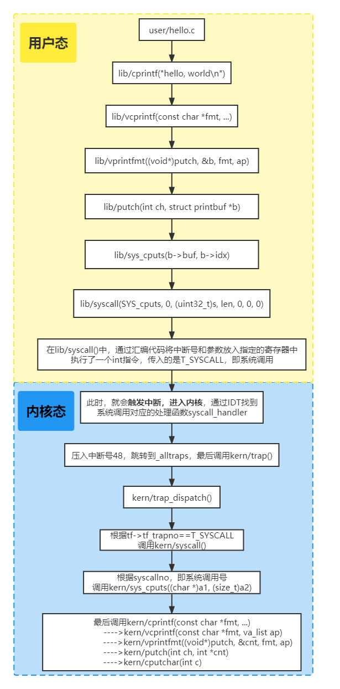

## User-mode startup

用户程序真正开始运行的地方在lib/entry.S文件中。该文件中，首先会进行一些设置，然后就会调用`lib/libmain.c`文件中的`libmain()`函数。修改一下`libmain()`函数，使它能够初始化全局指针 `thisenv`，让它指向当前用户环境的`Env`结构体：

通过查看`inc/env.h`知道：env_id的值包含三部分，第31位被固定为0；第10~30这21位是标识符，标示这个用户环境；第0~9位代表这个用户环境所采用的 Env 结构体，在envs数组中的索引。

```c
void libmain(int argc, char **argv)
{
	// set thisenv to point at our Env structure in envs[].
	// LAB 3: Your code here.
	thisenv = &envs[ENVX(sys_getenvid())];

	// save the name of the program so that panic() can use it
	if (argc > 0)
		binaryname = argv[0];

	// call user main routine
	umain(argc, argv);

	// exit gracefully
	exit();
}
```


##  Page faults and memory protection

系统调用也为内存保护带来了问题。大部分系统调用接口让用户程序传递一个指针参数给内核。这些指针指向的是用户缓冲区。通过这种方式，系统调用在执行时就可以解引用这些指针。但是这里有两个问题：

1. 在内核中的page fault要比在用户程序中的page fault更严重。如果内核在操作自己的数据结构时出现 page faults，这是一个内核的bug，而且异常处理程序会中断整个内核。但是当内核在解引用由用户程序传递来的指针时，它需要一种方法去记录此时出现的任何page faults都是由用户程序带来的。

2. 内核通常比用户程序有着更高的内存访问权限。用户程序很有可能要传递一个指针给系统调用，这个指针指向的内存区域是内核可以进行读写的，但是用户程序不能。此时内核必须小心不要去解析这个指针，否则的话内核的重要信息很有可能被泄露。

修改`kern/trap.c`文件，使其能够实现：当在内核模式下发现页错误，`trap.c`文件会panic：

1. 首先如果页错误发生在内核态时应该直接panic。

   ```c
   //在page_fault_handler中添加
   if ((tf->tf_cs & 3) == 0)//发生在内核态
   		panic("page_falut in kernel mode, fault address %d\n", fault_va);
   ```

2. 实现`kern/pmap.c`中的`user_mem_check()`工具函数，该函数检测用户环境是否有权限访问线性地址区域[va, va+len)。然后对在`kern/syscall.c`中的系统调用函数使用`user_mem_assert()`工具函数进行内存访问权限检查。

   ```c
   int user_mem_check(struct Env *env, const void *va, size_t len, int perm)
   {
   	// LAB 3: Your code here.
   	size_t start = (size_t)ROUNDDOWN(va, PGSIZE);
   	size_t end = (size_t)ROUNDUP(va + len, PGSIZE);
   
   	while (start < end)
   	{
           //查询虚拟地址对应的页表项
   		pte_t *pte = pgdir_walk(env->env_pgdir, (void *)start, 0);
   		if (start >= ULIM ||	//ULIM以上为内核空间
   			!pte ||				//对应的页表项为NULL
   			!(*pte & PTE_P) ||	//对应的页表项无效
   			((*pte & perm) != perm))//对应的页表项不满足perm权限
   		{
   			user_mem_check_addr = start > (size_t)va ? start : (size_t)va;
   			return -E_FAULT;
   		}
   
   		start += PGSIZE;
   	}
   	return 0;
   }
   ```

   在`kern/syscall.c`中，对需要进行指针检测的添加`user_mem_assert()`函数：

   ```c
   static void
   sys_cputs(const char *s, size_t len)
   {
   	// Check that the user has permission to read memory [s, s+len).
   	// Destroy the environment if not.
   
   	// LAB 3: Your code here.
   	user_mem_assert(curenv, s, len, 0);
   
   	// Print the string supplied by the user.
   	cprintf("%.*s", len, s);
   }
   ```

### 缺页错误补充：

缺页中断会交给`Page_Fault_Handler`处理，其根据缺页中断的不同类型会进行不同的处理：

- `Hard Page Fault` 也被称为Major Page Fault，翻译为硬缺页错误/主要缺页错误，这时**物理内存中没有对应的页帧，需要CPU打开磁盘设备读取到物理内存中，再让MMU建立VA和PA的映射**。
- `Soft Page Fault` 也被称为Minor Page Fault，翻译为软缺页错误/次要缺页错误，这时**物理内存中是存在对应页帧的，只不过可能是其他进程调入的，发出缺页异常的进程不知道而已，此时MMU只需要建立映射即可，无需从磁盘读取写入内存，一般出现在多进程共享内存区域**。
- `Invalid Page Fault` 翻译为无效缺页错误，比如**进程访问的内存地址越界访问，又比如对空指针解引用内核就会报segment fault错误中断进程直接挂掉**。


# 参考文章

[MIT 6.828 JOS学习笔记17. Lab 3.1 Part A User Environments - fatsheep9146 - 博客园 (cnblogs.com)](https://www.cnblogs.com/fatsheep9146/p/5341836.html)

[MIT 6.828 JOS学习笔记18. Lab 3.2 Part B: Page Faults, Breakpoints Exceptions, and System Calls - fatsheep9146 - 博客园 (cnblogs.com)](https://www.cnblogs.com/fatsheep9146/p/5451579.html)

[MIT-6.828-JOS-lab3:User Environments - gatsby123 - 博客园 (cnblogs.com)](https://www.cnblogs.com/gatsby123/p/9838304.html)


# MIT6.828——Lab 4: Preemptive Multitasking

# Part A: Multiprocessor Support and Cooperative Multitasking

- 使JOS支持多处理器（CPU）
- 实现新的系统调用——允许用户级环境创建其他环境
- 实现协作轮询调度——允许内核从一个主动放弃CPU的环境切换到另一个环境

## Multiprocessor Support

**把SMP技术应用在单个CPU中，为了与SMP区分，单个物理CPU内，等同原来单个CPU的模块称之为Core（核心），这样的CPU称之为多核CPU。**

我们将让 JOS 支持对称多处理器（symmetric multiprocessing，SMP），这是一种多处理器模型，其中所有CPU都具有对系统资源（如内存和I / O总线）的等效访问。虽然所有CPU在SMP中功能相同，但在引导过程中它们可分为两种类型：

- 引导处理器（BSP）：负责初始化系统和引导操作系统;
- 应用程序处理器（AP）：只有在操作系统启动并运行后，BSP才会激活应用程序处理器。

在SMP系统中，每个CPU都有一个附带的本地APIC（LAPIC）单元。

APIC:Advanced Programmable Interrupt Controller高级可编程中断控制器 。APIC 是装置的扩充组合用来驱动 Interrupt 控制器 。在目前的建置中，系统的每一个部份都是经由 APIC Bus 连接的。"本机 APIC" 为系统的一部份，负责传递 Interrupt 至指定的处理器；举例来说，当一台机器上有三个处理器则它必须相对的要有三个本机 APIC。

LAPIC单元负责在整个系统中提供中断。 LAPIC还为其连接的CPU提供唯一标识符。 在本实验中，我们使用LAPIC单元的以下基本功能（在`kern/lapic.c`中）：

- 根据LAPIC识别码（APIC ID）区别我们的代码运行在哪个CPU上。（`cpunum()`）
- 从BSP向APs发送`STARTUP`处理器间中断（IPI）去唤醒其他的CPU。（`lapic_startap()`）
- 在Part C，我们编写LAPIC的内置定时器来触发时钟中断，以支持抢占式多任务（`pic_init()`）。


### MMIO

处理器通过内存映射IO(MMIO)的方式访问它的LAPIC。在MMIO中，一部分物理地址被硬连接到一些IO设备的寄存器，导致操作内存的指令load/store可以直接操作设备的寄存器。

[内存映射IO与端口映射IO](https://blog.csdn.net/qq_43606914/article/details/106959334)：

MMIO(Memory mapping [I/O](https://link.zhihu.com/?target=https%3A//baike.baidu.com/item/I%2FO/84718))即[内存映射I/O](https://link.zhihu.com/?target=https%3A//baike.baidu.com/item/%E5%86%85%E5%AD%98%E6%98%A0%E5%B0%84I%2FO)，它是PCI规范的一部分，[I/O设备](https://link.zhihu.com/?target=https%3A//baike.baidu.com/item/I%2FO%E8%AE%BE%E5%A4%87/9688581)被放置在内存空间而不是I/O空间。从处理器的角度看，内存映射I/O后系统设备访问起来和内存一样。这样访问AGP/PCI-E显卡上的[帧缓存](https://link.zhihu.com/?target=https%3A//baike.baidu.com/item/%E5%B8%A7%E7%BC%93%E5%AD%98)，BIOS，PCI设备就可以使用读写内存一样的[汇编指令](https://link.zhihu.com/?target=https%3A//baike.baidu.com/item/%E6%B1%87%E7%BC%96%E6%8C%87%E4%BB%A4)完成，简化了程序设计的难度和接口的复杂性。

PortIO和MMIO 的主要区别
1）前者不占用CPU的物理地址空间，后者占有（这是对x86架构说的，一些架构，如IA64，port I/O占用物理地址空间）。

2）前者是顺序访问。也就是说在一条I/O指令完成前，下一条指令不会执行。例如通过Port I/O对设备发起了操作，造成了设备寄存器状态变化，这个变化在下一条指令执行前生效。uncache的MMIO通过uncahce memory的特性保证顺序性。

3）使用方式不同

由于port I/O有独立的64K I/O地址空间，但CPU的地址线只有一套，所以必须区分地址属于物理地址空间还是I/O地址空间。


### `kern/pmap.c`::`mmio_map_region(physaddr_t pa, size_t size)`：

**将[pa,pa+size)映射到MMIO区域**

在前面的lab中提到虚拟内存的分布图（memlayout.h中），有一部分是[MMIOBASE,MMIOLIM]——这就是内存映射IO区

```c
void *
mmio_map_region(physaddr_t pa, size_t size)
{
	// Where to start the next region.  Initially, this is the
	// beginning of the MMIO region.  Because this is static, its
	// value will be preserved between calls to mmio_map_region
	// (just like nextfree in boot_alloc).
	static uintptr_t base = MMIOBASE;

	// Your code here:
	void *start = (void *)base;
	size = ROUNDUP(size, PGSIZE);//对齐
	if (base + size >= MMIOLIM || base + size < base)//越界
		panic("mmio_map_region failed: size is too big!\n");
	boot_map_region(kern_pgdir, base, size, pa, PTE_W | PTE_PCD | PTE_PWT);
	base += size;
	return start;
	// panic("mmio_map_region not implemented");
}
```


## Application Processor Bootstrap

在启动APs之前，BSP应该先收集关于多处理器系统的配置信息，比如CPU总数，CPUs的APIC ID，LAPIC单元的MMIO地址等。在`kern/mpconfig.c`文件中的`mp_init()`函数通过读BIOS设定的MP配置表获取这些信息。
`boot_aps(kern/init.c)`函数驱使AP引导程序。APs开始于实模式，跟BSP的开始相同，故此`boot_aps`函数拷贝AP入口代码(kern/mpentry.S)到实模式下的内存寻址空间。但是跟BSP不一样的是，我们需要有一些控制当AP开始执行时。我们将拷贝入口代码到0x7000(MPENTRY_PADDR)。
之后，`boot_aps`函数通过发送STARTUP的IPI(处理器间中断)信号到AP的LAPIC单元来一个个地激活AP。在`kern/mpentry.S`中的入口代码跟`boot/boot.S`中的代码类似。在一些简短的配置后，它使AP进入开启分页机制的保护模式，调用C语言的`mp_main`函数进行setup。

为AP的启动代码保存一个物理页，不能被其他使用：

```c
	// LAB 4:
	// Change your code to mark the physical page at MPENTRY_PADDR
	// as in use
	else if (i == mpentry)
	{
		pages[i].pp_ref = 1;
		pages[i].pp_link = NULL;
	}
```

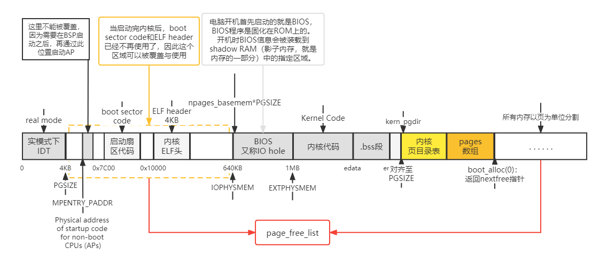

整理一下程序运行过程，此过程一直都运行在CPU0，即BSP上，工作在保护模式。

- `i386_init`调用了`boot_aps()`，也就是在BSP中引导其他CPU开始运行
- `boot_aps`调用`memmove`将每个CPU的boot代码加载到固定位置
- 最后调用`lapic_startap`执行其bootloader启动对应的CPU


## Per-CPU State and Initialization

在kern/cpu.h中定义了大部分的per-CPU状态。每个CPU独有的变量应该有：

1. 内核栈：不同的核可能同时进入到内核中执行，因此需要有不同的内核栈
2. TSS和TSS描述符：每个CPU都需要单独的TSS和TSS描述符来指定该CPU对应的内核栈。
3. 进程结构指针：每个CPU都会独立运行一个进程的代码，所以需要Env指针。
4. 系统寄存器：比如cr3, gdt, ltr这些寄存器都是每个CPU私有的，每个CPU都需要单独设置。

### [任务状态段TSS及TSS描述符、局部描述符表LDT及LDT描述符](https://blog.csdn.net/MJ_Lee/article/details/104419980)

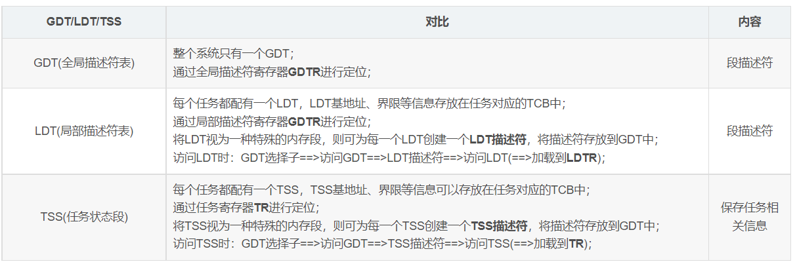


### `kern/pmap.c` : :`mem_init_mp`:

**将内核栈线性地址映射到percpu_kstacks处的物理地址处。**

```c
static void
mem_init_mp(void)
{
	// LAB 4: Your code here:
	int i;
	uintptr_t kstacktop_i;
	for (i = 0; i < NCPU; ++i)
	{
		kstacktop_i = KSTACKTOP - i * (KSTKGAP + KSTKSIZE);
		boot_map_region(kern_pgdir,
						kstacktop_i - KSTKSIZE,
						KSTKSIZE,
						PADDR(&percpu_kstacks[i]),
						PTE_W);
	}
}
```

### `kern/trap.c` : :`trap_init_percpu`:

**由于有多个CPU，所以在这里不能使用原先的全局变量ts，应该利用thiscpu指向的CpuInfo结构体和cpunum函数来为每个核的TSS进行初始化**

```c
// Initialize and load the per-CPU TSS and IDT
void trap_init_percpu(void)
{
	// LAB 4: Your code here:

	// Setup a TSS so that we get the right stack
	// when we trap to the kernel.
	int i = cpunum();
	thiscpu->cpu_ts.ts_esp0 = KSTACKTOP - i * (KSTKSIZE + KSTKGAP);
	thiscpu->cpu_ts.ts_ss0 = GD_KD;
	thiscpu->cpu_ts.ts_iomb = sizeof(struct Taskstate);

	// Initialize the TSS slot of the gdt.
	gdt[(GD_TSS0 >> 3) + i] = SEG16(STS_T32A, (uint32_t)(&thiscpu->cpu_ts),
									sizeof(struct Taskstate) - 1, 0);
	gdt[(GD_TSS0 >> 3) + i].sd_s = 0;

	// Load the TSS selector (like other segment selectors, the
	// bottom three bits are special; we leave them 0)
	ltr(GD_TSS0 + (i << 3));

	// Load the IDT
	lidt(&idt_pd);
}
```


## Locking

在mp_main函数中初始化AP后，代码就会进入自旋。在让AP进行更多操作之前，我们首先要解决多CPU同时运行在内核时产生的竞争问题。最简单的办法是实现1个大内核锁，1次只让一个进程进入内核模式，当离开内核时释放锁。

在kern/spinlock.h中声明了大内核锁，提供了lock_kernel和unlock_kernel函数来快捷地获得和释放锁。总共有四处用到大内核锁：

- `i386_init()`在启动的时候，BSP启动其余的CPU之前，BSP需要取得内核锁

- `mp_main`中，也就是CPU被启动之后执行的第一个函数，这里应该是调用调度函数，选择一个进程来执行的，但是在执行调度函数之前，必须获取锁

- `trap`函数也要修改，因为可以访问临界区的CPU只能有一个，所以从用户态陷入到内核态的话，要加锁，因为可能多个CPU同时陷入内核态

- `env_run`函数，也就是启动进程的函数，之前在试验3中实现的，在这个函数执行结束之后，就将跳回到用户态，此时离开内核，也就是需要将内核锁释放

加锁后，将原有的并行执行过程在关键位置变为串行执行过程，整个启动过程大概如下：

i386_init–>BSP获得锁–>boot_ap–>(BSP建立为每个cpu建立idle任务、建立用户任务，mp_main)—>BSP的sched_yield–>其中的env_run释放锁–>AP1获得锁–>执行sched_yield–>释放锁–>AP2获得锁–>执行sched_yield–>释放锁…..

### `spin lock` VS `sleep lock`

- 当一个进程获取`spin lock`时，如果发现锁住的情况，则会进入忙等待，一直占用CPU而不主动让出，知道解锁或时间片用完
- 当一个进程获取`sleep lock`时，如果发现锁住的情况，则会进入阻塞状态，主动让出CPU，等待下次被唤醒，再检查锁情况


## Round-Robin Scheduling

现在需要让CPU能在进程间切换，需要完成两件事：

- 实现sched_yield()，该函数选择一个新的进程运行，从当前正在运行进程对应的Env结构下一个位置开始循环搜索envs数组，找到第一个cpu_status为`ENV_RUNNABLE`的Env结构，然后调用`env_run()`在当前CPU运行这个新的进程。

  ```c
  // Choose a user environment to run and run it.
  void sched_yield(void)
  {
  	struct Env *idle;
  
  	// LAB 4: Your code here.
  	idle = curenv;
  	size_t i = idle != NULL ? ENVX(idle->env_id) + 1 : 0;
  	size_t j;
  	for (j = 0; j != NENV; j++, i = (i + 1) % NENV)
  	{
  		if (envs[i].env_status == ENV_RUNNABLE)
  		{
  			envs[i].env_cpunum = cpunum();
  			env_run(envs + i);
  		}
  	}
  	if (idle && idle->env_status == ENV_RUNNING)
  	{
  		curenv->env_cpunum = cpunum();
  		env_run(idle);
  	}
  	// sched_halt never returns
  	sched_halt();
  }
  ```

- 实现一个新的系统调用sys_yield()，使得用户程序能在用户态通知内核，当前进程希望主动让出CPU给另一个进程。

  在`kern/syscall.c`::`syscall`中添加：

  ```c
  case SYS_yield:
  		sys_yield();
  ```


## System Calls for Environment Creation

目前，内核可以在多进程间切换，但仅限于内核创建好的进程。

因此，接下来，为进程提供系统调用，从而使进程能创建新进程。

现在需要实现如下系统调用：

1. `sys_exofork()：`创建一个新的进程，用户地址空间没有映射，不能运行，寄存器状态和父环境一致。在父进程中`sys_exofork()`返回新进程的envid，子进程返回0。

   ```c
   static envid_t
   sys_exofork(void)
   {
   	// LAB 4: Your code here.
   	struct Env *e;
   	int ret = env_alloc(&e, curenv->env_id);
   	if (ret < 0)
   		return ret;
   	e->env_status = ENV_NOT_RUNNABLE;
   	e->env_tf = curenv->env_tf;
   	e->env_tf.tf_regs.reg_eax = 0;//前面的lab说过，eax作为系统调用号，也作为返回值，子进程会返回零
   	return e->env_id;
   	// panic("sys_exofork not implemented");
   }
   ```

2. `sys_env_set_status：`设置一个特定进程的状态为`ENV_RUNNABLE`或`ENV_NOT_RUNNABLE`。

   ```c
   sys_env_set_status(envid_t envid, int status)
   {
   	// LAB 4: Your code here.
   	struct Env *e;
   	int ret = envid2env(envid, &e, 1);
   	if (ret < 0)
   		return ret;
   	if (status != ENV_RUNNABLE && status != ENV_NOT_RUNNABLE)
   		return -E_INVAL;
   	e->env_status = status;
   	return 0;
   	// panic("sys_env_set_status not implemented");
   }
   ```

3. `sys_page_alloc：`为特定进程分配一个物理页，映射指定线性地址va到该物理页。

   ```c
   static int
   sys_page_alloc(envid_t envid, void *va, int perm)
   {
   	// LAB 4: Your code here.
   	struct Env *e;
   	int ret = envid2env(envid, &e, 1);
   	if (ret < 0)
   		return ret;
   	if ((uintptr_t)va >= UTOP || PGOFF(va))
   		return -E_INVAL;
   	int flag = PTE_U | PTE_P;
   	if ((perm & flag) != flag || (perm & ~(PTE_SYSCALL)) != 0)
   		return -E_INVAL;
   	struct PageInfo *pg = page_alloc(1);
   	if (pg == NULL)
   		return -E_NO_MEM;
   	if (page_insert(e->env_pgdir, pg, va, perm) < 0)
   	{
   		page_free(pg);
   		return -E_NO_MEM;
   	}
   	return 0;
   	// panic("sys_page_alloc not implemented");
   }
   ```

4. `sys_page_map：`拷贝页表，使指定进程共享当前进程相同的映射关系。本质上是修改特定进程的页目录和页表。

   ```c
   static int
   sys_page_map(envid_t srcenvid, void *srcva,
   			 envid_t dstenvid, void *dstva, int perm)
   {
   	// LAB 4: Your code here.
   	struct Env *se, *de;
   	int ret = envid2env(srcenvid, &se, 1);
   	if (ret < 0)
   		return ret;
   	ret = envid2env(dstenvid, &de, 1);
   	if (ret < 0)
   		return ret;
   	if ((uintptr_t)srcva >= UTOP || PGOFF(srcva) ||
   		(uintptr_t)dstva >= UTOP || PGOFF(dstva))
   		return -E_INVAL;
   	int flag = PTE_U | PTE_P;
   	if ((perm & flag) != flag || (perm & ~(PTE_SYSCALL)) != 0)
   		return -E_INVAL;
   	pte_t *entry;
   	struct PageInfo *pg = page_lookup(se->env_pgdir, srcva, &entry);
   	if (pg == NULL)
   		return -E_INVAL;
   	if ((perm & PTE_W) && (*entry & PTE_W) == 0)
   		return -E_INVAL;
   	if (page_insert(de->env_pgdir, pg, dstva, perm) < 0)
   		return -E_NO_MEM;
   	return 0;
   	// panic("sys_page_map not implemented");
   }
   ```

5. `sys_page_unmap：`解除页映射关系。本质上是修改指定用户环境的页目录和页表。

   ```c
   static int
   sys_page_unmap(envid_t envid, void *va)
   {
   	// Hint: This function is a wrapper around page_remove().
   
   	// LAB 4: Your code here.
   	struct Env *e;
   	int ret = envid2env(envid, &e, 1);
   	if (ret < 0)
   		return ret;
   	if ((uintptr_t)va >= UTOP || PGOFF(va))
   		return -E_INVAL;
   	page_remove(e->env_pgdir, va);
   	return 0;
   	// panic("sys_page_unmap not implemented");
   }
   ```


# Part B: Copy-on-Write Fork

一般fork()会将父进程的地址空间完全复制到子进程中，但子进程通常会立即调用exec()函数族，用新的程序替换复制的内容。因此，复制父进程是非常浪费时间的。

写时复制（COW）：将父进程的地址映复制给子进程，即父子进程共享同一个地址空间，将共享的空间标记为只读并设置COW位。当其中一个进程尝试写入共享页面时，该进程会出现页错误，从而进入内核进行处理。

## User-level page fault handling

用户级写时复制需要了解写保护页面上的页面错误，写时复制只是用户级缺页中断处理的一种。

通常建立地址空间以便page fault提示何时需要执行某些操作。例如大多数Unix内核初始只给新进程的栈映射一个页，以后栈增长会导致page fault从而映射新的页。一个典型的Unix内核必须记录在进程地址空间的不同区域发生page fault时，应该执行什么操作。例如栈上缺页，会实际分配和映射新的物理内存。BSS区域缺页会分配新的物理页，填充0，然后映射。这种设计在定义他们的内存区域的时候具有极大的灵活度。

### Setting the Page Fault Handler

1个用户级写时拷贝的fork函数需要在写保护页时触发page fault，所以我们第一步应该先规定或者确立一个page fault处理例程，每个进程需要向内核注册这个处理例程，只需要传递一个函数指针即可，`sys_env_set_pgfault_upcall`函数将当前进程的page fault处理例程设置为func指向的函数。

`kern/syscall.c` : :`sys_env_set_pgfault_upcall(envid_t envid, void *func)`:

该系统调用为指定的用户环境设置`env_pgfault_upcall`。缺页中断发生时，会执行`env_pgfault_upcall`指定位置的代码。当执行`env_pgfault_upcall`指定位置的代码时，栈已经转到异常栈，并且压入了`UTrapframe`结构。

```c
static int
sys_env_set_pgfault_upcall(envid_t envid, void *func)
{
	// LAB 4: Your code here.
	struct Env *e;
	if (envid2env(envid, &e, 1) < 0)
		return -E_BAD_ENV;
	e->env_pgfault_upcall = func;
	return 0;
	// panic("sys_env_set_pgfault_upcall not implemented");
}

//还要将其加入到syscall()函数中
case SYS_env_set_pgfault_upcall:
		return sys_env_set_pgfault_upcall(a1, (void *)a2);
```


### Normal and Exception Stacks in User Environments

在正常运行期间，用户进程运行在用户栈上，栈顶寄存器ESP指向USTACKTOP处，堆栈数据位于USTACKTOP-PGSIZE 与USTACKTOP-1之间的页。当在用户模式发生1个page fault时，内核将在专门处理page fault的用户异常栈上重新启动进程。

到目前为止出现三个栈：

```shell
[KSTACKTOP-KSTKSIZE,  KSTACKTOP) 
　　内核态系统栈

[UXSTACKTOP - PGSIZE, UXSTACKTOP )
　　用户态错误处理栈

[UTEXT, USTACKTOP)
　　用户态运行栈
```

### Invoking the User Page Fault Handler

用户定义注册了自己的中断处理程序之后，相应的例程运行时的栈，整个过程如下：

1. 首先陷入到内核，栈位置从用户运行栈切换到内核栈，进入到trap中，进行中断处理分发，进入到`page_fault_handler()`
2. 当确认是用户程序触发的page fault的时候(内核触发的直接panic了)，为其在用户错误栈里分配一个`UTrapframe`的大小。
3. 把栈切换到用户错误栈，运行响应的用户中断处理程序，中断处理程序可能会触发另外一个同类型的中断，这个时候就会产生递归式的处理。处理完成之后，返回到用户运行栈。

### `page_fault_handler(struct Trapframe *tf)`：

在该函数中应该做如下几件事：

1. 判断curenv->env_pgfault_upcall是否设置，如果没有设置也就没办法修复，直接销毁该进程。

2. 判断esp位置，切换到用户异常栈。

   ​		当正常执行过程中发生了页错误，那么栈的切换是
   　　		**用户运行栈—>内核栈—>异常栈**
   　　而如果在异常处理程序中发生了也错误，那么栈的切换是
   　　		**异常栈—>内核栈—>异常栈**

3. 在异常栈上压入一个UTrapframe结构，其结构如下：

   ```c
                       <-- UXSTACKTOP
   trap-time esp
   trap-time eflags
   trap-time eip
   trap-time eax	----|       start of struct PushRegs
   trap-time ecx		|
   trap-time edx		|
   trap-time ebx		|
   trap-time esp		|
   trap-time ebp		|
   trap-time esi		|
   trap-time edi	----|       end of struct PushRegs
   tf_err (error code)
   fault_va            <-- %esp when handler is run
   ```

   

4. 将eip设置为curenv->env_pgfault_upcall，然后回到用户态执行curenv->env_pgfault_upcall处的代码。

```c
void page_fault_handler(struct Trapframe *tf)
{
	uint32_t fault_va;

	// Read processor's CR2 register to find the faulting address
	fault_va = rcr2();

	// Handle kernel-mode page faults.
	// LAB 3: Your code here.
	if ((tf->tf_cs & 3) == 0)
		panic("page_falut in kernel mode, fault address %d\n", fault_va);

	// LAB 4: Your code here.
	struct UTrapframe *utf;
	if (curenv->env_pgfault_upcall) //判断
	{
		if (tf->tf_esp >= UXSTACKTOP - PGSIZE && tf->tf_esp < UXSTACKTOP)
		{
			// on exception user
			utf = (struct UTrapframe *)(tf->tf_esp - sizeof(struct UTrapframe) - 4);
		}
		else
		{
			// on normal user
			utf = (struct UTrapframe *)(UXSTACKTOP - sizeof(struct UTrapframe));
		}
		//检查异常栈是否溢出
		user_mem_assert(curenv, (const void *)utf, sizeof(struct UTrapframe), PTE_P | PTE_W | PTE_U);
		utf->utf_fault_va = fault_va;
		utf->utf_err = tf->tf_err;
		utf->utf_regs = tf->tf_regs;
		utf->utf_eflags = tf->tf_eflags;

        //保存上下文，方便从异常栈退出时找到之前的位置
		utf->utf_eip = tf->tf_eip;
		utf->utf_esp = tf->tf_esp;
		
        //切换下一个指令：即运行处理函数
		curenv->env_tf.tf_eip = (uint32_t)curenv->env_pgfault_upcall;
        //切换到异常栈上
		curenv->env_tf.tf_esp = (uint32_t)utf;
		env_run(curenv);
	}
	else
	{
		// Destroy the environment that caused the fault.
		cprintf("[%08x] user fault va %08x ip %08x\n",
				curenv->env_id, fault_va, tf->tf_eip);
		print_trapframe(tf);
		env_destroy(curenv);
	}
}
```

压入异常栈过程：

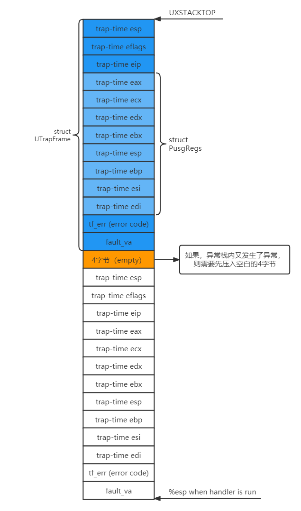


### User-mode Page Fault Entrypoint

用户page fault注册流程：

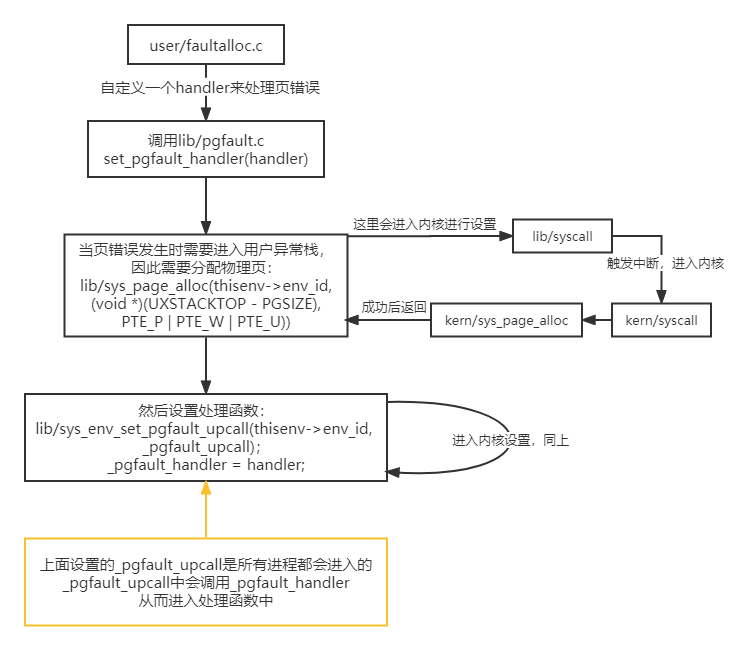

当从用户定义的处理函数返回之后，如何从用户错误栈直接返回到用户运行栈。

#### `lib/pfentry.S` : :`_pgfault_upcall`:

是所有用户页错误处理程序的入口，在这里调用用户自定义的处理程序，并在处理完成后，从错误栈中保存的UTrapframe中恢复相应信息，然后跳回到发生错误之前的指令，恢复原来的进程运行。

_pgfault_handler完成但返回到先前状态之前的内容：


```assembly
_pgfault_upcall:
	// Call the C page fault handler.
	pushl %esp			// function argument: pointer to UTF
	movl _pgfault_handler, %eax
	call *%eax
	addl $4, %esp			// pop function argument
	
	//当_pgfault_handler处理结束后，需要返回到之前的状态
	// LAB 4: Your code here.
	movl 48(%esp),%eax	//取出栈中的trap-time esp，即上文esp
	subl $4,%eax		// 将其减4，如果是用户栈的esp则自动空一格
						//如果是异常栈的esp，因前面保存了一个4字节空间，所以正合适
	movl %eax,48(%esp)	//再存回trap-time esp中
	movl 40(%esp),%ebx	//取出上文eip
	movl %ebx,(%eax)	//放入上文esp指向的空间，即保留的4字节空间

	// Restore the trap-time registers.  After you do this, you
	// can no longer modify any general-purpose registers.
	// LAB 4: Your code here.
	addl $8,%esp	//将esp上移两个4字节，此时指向struct PushRegs end
	popal			//将struct PushRegs整个pop出来，此时esp指向trap-time eip

	// Restore eflags from the stack.  After you do this, you can
	// no longer use arithmetic operations or anything else that
	// modifies eflags.
	// LAB 4: Your code here.
	addl $4,%esp	//上移一个4字节，此时esp指向trap-time eflags
	popfl			//将efalgs pop出来，此时指向tarp-time esp

	// Switch back to the adjusted trap-time stack.
	// LAB 4: Your code here.
	popl %esp	//将trap-time esp（即上文esp） pop出来，由esp寄存器保存
				//此时指向的是预留的那4字节，由上面可知，保存了上文eip

	// Return to re-execute the instruction that faulted.
	// LAB 4: Your code here.
	ret			//ret会读取esp指向的内容，并保存在eip中，即将上文eip保存在eip寄存器中
```

#### `lib/pgfault.c`::`set_pgfault_handler`：

**用户通过调用此函数进行设置pgfault_handler**

```c
void set_pgfault_handler(void (*handler)(struct UTrapframe *utf))
{
	int r;

	if (_pgfault_handler == 0)
	{
		// First time through!
		// LAB 4: Your code here.
		if ((r = sys_page_alloc(thisenv->env_id,
								(void *)(UXSTACKTOP - PGSIZE),
								PTE_P | PTE_W | PTE_U)) < 0)
			panic("set_pgfault_handler: %e", r);
		sys_env_set_pgfault_upcall(thisenv->env_id, _pgfault_upcall);
		// panic("set_pgfault_handler not implemented");
	}

	// Save handler pointer for assembly to call.
	_pgfault_handler = handler;
}
```


## Implementing Copy-on-Write Fork

与`dumfork`不同的是，fork 只复制了页映射关系，并且只在尝试对页进行写操作时才进行页内容的 copy。

`fork`控制流如下：

1. 父进程注册handler
2. 父进程call `sys_exofork` 创建子进程
3. 对每个处于 `UTOP`之下的可写或COW页进行复制`duppage`。**它应该将 copy-on-write 页面映射到子进程的地址空间，然后重新映射 copy-on-write 页面到它自己的地址空间。**

此处的顺序十分重要——先将子进程的页标记为`COW`，然后将父进程的页标记为`COW`：

猜测：如果先将父进程标记为COW，此时，如果有另一个进程抢占CPU，那么此时的子进程此时的状态并没有COW，则如果子进程被改变时，并不会发生COW，以至于修改了与父进程共享的内存

### `lib/fork.c`::`pgfault(struct UTrapframe *utf)`：

1. `pgfault()`检查错误是否为写入FEC_WR（在错误代码中检查），并且页面的 PTE 是否标记为 `PTE_COW`。如果没有，请panic。
2. `pgfault()`在临时位置分配映射的新页面，并将错误页面的内容复制到其中。然后，错误处理程序使用读/写权限将新页面映射到会修改该页的进程中的地址，以代替旧的只读映射。

```c
static void
pgfault(struct UTrapframe *utf)
{
	void *addr = (void *)utf->utf_fault_va;
	uint32_t err = utf->utf_err;
	int r;

	// LAB 4: Your code here.
	if (!((err & FEC_WR) && (uvpt[PGNUM(addr)] & PTE_COW)))
		panic("pgfault:not writabled or a COW page!\n");

	// LAB 4: Your code here.
	envid_t envid = sys_getenvid();
    //为PFTEMP分配一个物理页
	if ((r = sys_page_alloc(envid, (void *)PFTEMP, PTE_P | PTE_W | PTE_U)) < 0)
		panic("pgfault:page allocation failed: %e", r);
	addr = ROUNDDOWN(addr, PGSIZE);
    //将addr上的物理页内容拷贝到PFTEMP指向的物理页上
	memmove((void *)PFTEMP, (void *)addr, PGSIZE);
    //更改addr映射的物理页，改为与PFTEMP指向相同
	if ((r = sys_page_map(envid, PFTEMP, envid, addr, PTE_P | PTE_W | PTE_U)) < 0)
		panic("pgfault:page map failed: %e", r);
    //取消PFTEMP的映射
	if ((r = sys_page_unmap(envid, PFTEMP)) < 0)
		panic("pgfault: page unmap failed: %e", r);

	// panic("pgfault not implemented");
}
```


### `lib/fork.c`::`duppage(envid_t envid, unsigned pn)`:

**进行COW方式的页复制（相当于复制映射，而不是复制页本身），所以将当前进程的第pn页对应的物理页映射到envid的第pn页上去，同时将这一页都标记为COW。**

```c
static int
duppage(envid_t envid, unsigned pn)
{
	int r;

	// LAB 4: Your code here.
	void *addr = (void *)(pn * PGSIZE);
	if ((uvpt[pn] & PTE_W) || (uvpt[pn] & PTE_COW))
	{
		if ((r = sys_page_map(0, addr, envid, addr, PTE_P | PTE_U | PTE_COW)) < 0)
			return r;
		if ((r = sys_page_map(0, addr, 0, addr, PTE_P | PTE_U | PTE_COW)) < 0)
			return r;
	}
	else if ((r = sys_page_map(0, addr, envid, addr, PTE_P | PTE_U)) < 0)
		return r;
	// panic("duppage not implemented");
	return 0;
}
```


### `lib/fork.c`::`fork(void)`：

**设置异常处理函数，创建子进程，映射页面到子进程，为子进程分配用户异常栈并设置 `pgfault_upcall` 入口，将子进程设置为可运行的**

```c
envid_t
fork(void)
{
	// LAB 4: Your code here.
	set_pgfault_handler(pgfault); //为进程创建异常栈，并设置处理函数
	envid_t eid = sys_exofork();  //创建一个空进程，与父进程状态一致
	if (eid < 0)
		panic("fork failed: sys_exofork faied: %e", eid);
	if (eid == 0)
	{
		// child
		thisenv = &envs[ENVX(sys_getenvid())];
		return 0;
	}
	// parent
	size_t pn;
	int r;
	for (pn = PGNUM(UTEXT); pn < PGNUM(USTACKTOP); ++pn)
	{
		if ((uvpd[pn >> 10] & PTE_P) && (uvpt[pn] & PTE_P))
		{
			if ((r = duppage(eid, pn)) < 0)
				return r;
		}
	}
	// alloc a page and map for child exception stack
    //每个进程都必须有自己的异常栈，这样才能进行COW
	if ((r = sys_page_alloc(eid, (void *)(UXSTACKTOP - PGSIZE), PTE_U | PTE_P | PTE_W)) < 0)
		return r;
	extern void _pgfault_upcall(void);
	if ((r = sys_env_set_pgfault_upcall(eid, _pgfault_upcall)) < 0)
		return r;
	if ((r = sys_env_set_status(eid, ENV_RUNNABLE)) < 0)
		panic("sys_env_set_status failed: %e", r);
	return eid;
	// panic("fork not implemented");
}
```


# Part C: Preemptive Multitasking and Inter-Process communication (IPC)

实现抢占非协作式环境，并且实现进程间通信

## Clock Interrupts and Preemption

如果一个进程获得CPU后一直死循环而不主动让出CPU的控制权， 整个系统都将 halt。为了允许内核抢占正在运行的环境，强行重获CPU控制权，我们必须扩展JOS内核以支持来自时钟的外部硬件中断。

### Interrupt discipline

外部中断（如设备中断）被称为 IRQs。 IRQ号到 IDT 项的映射不是固定的，其会加上一个IRQ_OFFSET的偏移，在`picirq.c `的`pic_init`中进行了这个映射过程。外部中断的初始化，实际上就是对硬件 8259A的初始化。

修改`kern/trapentry.S`和`kern/trap.c `来初始化IDT中IRQs0-15的入口和处理函数。然后修改`env_alloc`函数来确保进程在用户态运行时中断是打开的：

```c
//kern/trapentry.S
TRAPHANDLER_NOEC(irq0_handler,IRQ_OFFSET+0)
TRAPHANDLER_NOEC(irq1_handler,IRQ_OFFSET+1)
TRAPHANDLER_NOEC(irq2_handler,IRQ_OFFSET+2)
TRAPHANDLER_NOEC(irq3_handler,IRQ_OFFSET+3)
TRAPHANDLER_NOEC(irq4_handler,IRQ_OFFSET+4)
TRAPHANDLER_NOEC(irq5_handler,IRQ_OFFSET+5)
TRAPHANDLER_NOEC(irq6_handler,IRQ_OFFSET+6)
TRAPHANDLER_NOEC(irq7_handler,IRQ_OFFSET+7)
TRAPHANDLER_NOEC(irq8_handler,IRQ_OFFSET+8)
TRAPHANDLER_NOEC(irq9_handler,IRQ_OFFSET+9)
TRAPHANDLER_NOEC(irq10_handler,IRQ_OFFSET+10)
TRAPHANDLER_NOEC(irq11_handler,IRQ_OFFSET+11)
TRAPHANDLER_NOEC(irq12_handler,IRQ_OFFSET+12)
TRAPHANDLER_NOEC(irq13_handler,IRQ_OFFSET+13)
TRAPHANDLER_NOEC(irq14_handler,IRQ_OFFSET+14)
TRAPHANDLER_NOEC(irq15_handler,IRQ_OFFSET+15)

//kern/trap.c 
void irq0_handler();
void irq1_handler();
void irq2_handler();
void irq3_handler();
void irq4_handler();
void irq5_handler();
void irq6_handler();
void irq7_handler();
void irq8_handler();
void irq9_handler();
void irq10_handler();
void irq11_handler();
void irq12_handler();
void irq13_handler();
void irq14_handler();
void irq15_handler();
//trap_init()
SETGATE(idt[IRQ_OFFSET + 0], 0, GD_KT, irq0_handler, 0);
SETGATE(idt[IRQ_OFFSET + 1], 0, GD_KT, irq1_handler, 0);
SETGATE(idt[IRQ_OFFSET + 2], 0, GD_KT, irq2_handler, 0);
SETGATE(idt[IRQ_OFFSET + 3], 0, GD_KT, irq3_handler, 0);
SETGATE(idt[IRQ_OFFSET + 4], 0, GD_KT, irq4_handler, 0);
SETGATE(idt[IRQ_OFFSET + 5], 0, GD_KT, irq5_handler, 0);
SETGATE(idt[IRQ_OFFSET + 6], 0, GD_KT, irq6_handler, 0);
SETGATE(idt[IRQ_OFFSET + 7], 0, GD_KT, irq7_handler, 0);
SETGATE(idt[IRQ_OFFSET + 8], 0, GD_KT, irq8_handler, 0);
SETGATE(idt[IRQ_OFFSET + 9], 0, GD_KT, irq9_handler, 0);
SETGATE(idt[IRQ_OFFSET + 10], 0, GD_KT, irq10_handler, 0);
SETGATE(idt[IRQ_OFFSET + 11], 0, GD_KT, irq11_handler, 0);
SETGATE(idt[IRQ_OFFSET + 12], 0, GD_KT, irq12_handler, 0);
SETGATE(idt[IRQ_OFFSET + 13], 0, GD_KT, irq13_handler, 0);
SETGATE(idt[IRQ_OFFSET + 14], 0, GD_KT, irq14_handler, 0);
SETGATE(idt[IRQ_OFFSET + 15], 0, GD_KT, irq15_handler, 0);

//kern/env.c::env_alloc()
// Enable interrupts while in user mode.
// LAB 4: Your code here.
e->env_tf.tf_eflags |= FL_IF;
```

### Handling Clock Interrupts

目前还需要在`trap_dispatch()`函数中添加时钟中断处理代码，这样才能重新进入内核，并切换另一个进程：

```c
	// Handle clock interrupts. Don't forget to acknowledge the
	// interrupt using lapic_eoi() before calling the scheduler!
	// LAB 4: Your code here.
	if (tf->tf_trapno == IRQ_OFFSET + IRQ_TIMER)
	{
		lapic_eoi();
		sched_yield();
	}
```


## Inter-Process communication (IPC)

### IPC in JOS

我们将要实现`sys_ipc_recv()`和`sys_ipc_try_send()`这两个系统调用，来实现进程间通信。并且实现两个包装函数`ipc_recv()`和` ipc_send()`。
JOS中进程间通信的“消息”包含两部分：

1. 一个32位的值。
2. 可选的页映射关系。

### Sending and Receiving Messages

`sys_ipc_recv()`和`sys_ipc_try_send()`是这么协作的：

1. 当某个进程调用`sys_ipc_recv()`后，该进程会阻塞（状态被置为`ENV_NOT_RUNNABLE`），直到另一个进程向它发送“消息”。当进程调用`sys_ipc_recv()`传入dstva参数时，表明当前进程准备接收页映射。
2. 进程可以调用`sys_ipc_try_send()`向指定的进程发送“消息”，如果目标进程已经调用了`sys_ipc_recv()`，那么就发送数据，然后返回0，否则返回`-E_IPC_NOT_RECV`，表示目标进程不希望接受数据。当传入srcva参数时，表明发送进程希望和接收进程共享srcva对应的物理页。如果发送成功了发送进程的srcva和接收进程的dstva将指向相同的物理页。

### Transferring Pages

当用户环境使用有效的`dstva`参数（低于UTOP）调用`sys_ipc_recv`时，环境表示它愿意接收页面映射。如果发送者发送一个页面，那么该页面应该在接收者的地址空间中的`dstva`映射。如果接收者已经在`dstva`上映射了一个页面，那么之前的页映射被取消。

当用户环境以有效的`srcva`（在UTOP下面）以及权限perm为参数调用`sys_ipc_try_send`时，这意味着发送者想要将当前映射到`srcva`的页面发送给接收者。在成功的IPC之后，发送方在其地址空间中的`srcva`保持页面的原始映射，但是接收方在其地址空间最初指定的`dstva`处获得了与发送者同一物理页的映射。因此，该页面在发送者和接收者之间共享。

如果发送者或接收者没有指示一个页面应该被传送，那么没有页面被传送。在任何IPC之后，内核将接收者的Env结构中的新字段env_ipc_perm设置为接收到的页面的权限，如果没有接收到页面，则为零。

在Env结构中增加了5个成员来实现IPC：

`env_ipc_recving`：当进程使用env_ipc_recv函数等待信息时，会将这个成员设置为1，然后堵塞等待；当一个进程向它发消息解除堵塞后，发送进程将此成员修改为0。

`env_ipc_dstva`：如果进程要接受消息并且是传送页，保存页映射的地址，且该地址<=UTOP。

`env_ipc_value`：若等待消息的进程接收到消息，发送方将接收方此成员设置为消息值。

`env_ipc_from`：发送方负责设置该成员为自己的envid号。

`env_ipc_perm`：如果进程要接收消息并且传送页，那么发送方发送页之后将传送的页权限赋给这个成员。

### `kern/syscall.c`::`sys_ipc_recv(void *dstva)`：

**当一个进程试图去接收信息的时候，应该将自己标记为正在接收信息，而且为了不浪费CPU资源，应该同时标记自己为ENV_NOT_RUNNABLE，只有当有进程向自己发了信息之后，才会重新恢复可运行。最后将自己标记为不可运行之后，调用调度器运行其他进程。**

```c
static int
sys_ipc_recv(void *dstva)
{
	// LAB 4: Your code here.
	if (dstva < (void *)UTOP && PGOFF(dstva))
		return -E_INVAL;
	curenv->env_ipc_recving = 1;
	curenv->env_ipc_dstva = dstva;
	curenv->env_status = ENV_NOT_RUNNABLE;
	curenv->env_ipc_from = 0;
	sched_yield();

	// panic("sys_ipc_recv not implemented");
	return 0;
}
```

### `kern/syscall.c`::`sys_ipc_try_send(envid_t envid, uint32_t value, void *srcva, unsigned perm)`：

**权限是否符合要求，要传送的页有没有，能不能将这一页映射到对方页表中去等等。如果srcva是在UTOP之下，那么说明是要共享内存，那就首先要在发送方的页表中找到srcva对应的页表项，然后在接收方给定的虚地址处插入这个页表项。接收完成之后，重新将当前进程设置为可运行，同时把env_ipc_recving设置为0，以防止其他的进程再发送，覆盖掉当前的内容。**

```c
static int
sys_ipc_try_send(envid_t envid, uint32_t value, void *srcva, unsigned perm)
{
	// LAB 4: Your code here.
	struct Env *dste;
	pte_t *pte;
	struct PageInfo *pg;
	int ret = envid2env(envid, &dste, 0);
	if (ret < 0)
		return ret;
	if (dste->env_ipc_recving == 0 || dste->env_ipc_from != 0)
		return -E_IPC_NOT_RECV;

	if (srcva < (void *)UTOP)
	{
		if (PGOFF(srcva) || (perm & PTE_P) == 0 || (perm & PTE_U) == 0 || (perm & ~(PTE_SYSCALL)))
			return -E_INVAL;
		if ((pg = page_lookup(curenv->env_pgdir, srcva, &pte)) == NULL)
			return -E_INVAL;
		if ((perm & PTE_W) && !(*pte & PTE_W))
			return -E_INVAL;
		if (dste->env_ipc_dstva)
		{
			if ((ret = page_insert(dste->env_pgdir, pg, dste->env_ipc_dstva, perm)) < 0)
				return ret;
			dste->env_ipc_perm = perm;
		}
	}
	dste->env_ipc_from = curenv->env_id;
	dste->env_ipc_recving = 0;
	dste->env_ipc_value = value;
	dste->env_status = ENV_RUNNABLE;
	dste->env_tf.tf_regs.reg_eax = 0;
	return 0;

	// panic("sys_ipc_try_send not implemented");
}
```

还需要在syscall函数中添加，才能最终实现系统调用：

```c
case SYS_ipc_try_send:
		return sys_ipc_try_send((envid_t)a1, (uint32_t)a2, (void *)a3, (unsigned)a4);
	case SYS_ipc_recv:
		return sys_ipc_recv((void *)a1);
```

### 接下来实现`lib/ipc.c`里面的`ipc_recv`和`ipc_send`：

```c
int32_t
ipc_recv(envid_t *from_env_store, void *pg, int *perm_store)
{
	// LAB 4: Your code here.
	if (pg == NULL)
		pg = (void *)UTOP;
	int ret = sys_ipc_recv(pg);
	if (from_env_store)
		*from_env_store = ret < 0 ? 0 : thisenv->env_ipc_from;
	if (perm_store)
		*perm_store = ret < 0 ? 0 : thisenv->env_ipc_perm;
	if (ret < 0)
		return ret;
	return thisenv->env_ipc_value;
	// panic("ipc_recv not implemented");
}

void ipc_send(envid_t to_env, uint32_t val, void *pg, int perm)
{
	// LAB 4: Your code here.
	if (pg == NULL)
		pg = (void *)UTOP;
	int ret;
	while (true)
	{
		ret = sys_ipc_try_send(to_env, val, pg, perm);
		if (ret == 0)
			return;
		else if (ret == -E_IPC_NOT_RECV)
			sys_yield();//通信失败，先主动放弃CPU，轮询运行后继续通信
		else
			panic("ipc_send failed: %e", ret);
	}
	// panic("ipc_send not implemented");
}
```

# 参考文章：

[MIT6.828 Part B: Copy-on-Write Fork_bysui的博客-CSDN博客](https://blog.csdn.net/bysui/article/details/51842817)

[MIT-6.828-JOS-lab4:Preemptive Multitasking - gatsby123 - 博客园 (cnblogs.com)](https://www.cnblogs.com/gatsby123/p/9930630.html)

[MIT 6.828 (四) Lab 4: Preemptive Multitasking_EW_DUST的博客-CSDN博客_lapic_eoi](https://blog.csdn.net/qq_40871466/article/details/104079699)


# MIT6.828——Lab 5: File system, Spawn and Shell

补充资料：

# file system

典型文件系统API：`open`、`write`、`link`、`unlink`、`read`、`close`

## 文件系统结构

inode：代表文件的对象

文件系统中核心的数据结构就是inode和file descriptor

后者主要与用户进程进行交互。

文件系统还挺复杂的，所以最好按照分层的方式进行理解。可以这样看：

- 在最底层是磁盘，也就是一些实际保存数据的存储设备，正是这些设备提供了持久化存储。
- 在这之上是buffer cache或者说block cache，这些cache可以避免频繁的读写磁盘。这里我们将磁盘中的数据保存在了内存中。
- 为了保证持久性，再往上通常会有一个logging层。许多文件系统都有某种形式的logging
- 在logging层之上，有inode cache，这主要是为了同步（synchronization）。inode通常小于一个disk block，所以多个inode通常会打包存储在一个disk block中。为了向单个inode提供同步操作，XV6维护了inode cache。
- 再往上就是inode本身了。它实现了read/write。
- 再往上，就是文件名，和文件描述符操作。

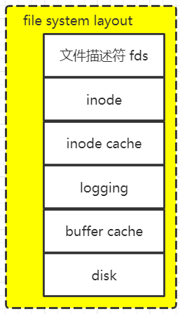


### 1、disk

- sector通常是磁盘驱动可以读写的最小单元，它过去通常是512字节。
- block通常是操作系统或者文件系统视角的数据。它由文件系统定义，在XV6中它是1024字节。所以XV6中一个block对应两个sector。通常来说一个block对应了一个或者多个sector。

通常来说：

- block0要么没有用，要么被用作`boot sector`来启动操作系统。
- block1通常被称为`super block`，它描述了文件系统。它包含磁盘上有多少个block共同构成了文件系统这样的信息。我们之后会看到XV6在里面会存更多的信息，你可以通过block1构造出大部分的文件系统信息。
- 在XV6中，log从block2开始，到block32结束。实际上log的大小可能不同，这里在super block中会定义log就是30个block。
- 接下来在block32到block45之间，XV6存储了inode。我之前说过多个inode会打包存在一个block中，一个inode是64字节。
- 之后是bitmap block，这是我们构建文件系统的默认方法，它只占据一个block。它记录了数据block是否空闲。
- 之后就全是数据block了，数据block存储了文件的内容和目录的内容。

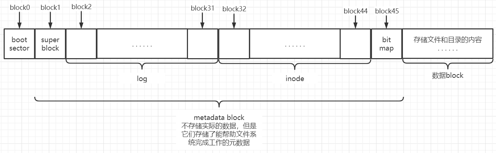

### 2、block cache（buffer cache）

block cache就是磁盘中block在内存中的拷贝

### 3、logging

文件系统crash之后的问题的解决方案，其实就是logging；

当需要更新文件系统时，我们并不是更新文件系统本身。假设我们在内存中缓存了bitmap block，也就是block 45。当需要更新bitmap时，我们并不是直接写block 45，而是将数据写入到log中，并记录这个更新应该写入到block 45。

### 4、inode

inode：64字节

- 通常来说它有一个type字段，表明inode是文件还是目录。
- nlink字段，也就是link计数器，用来跟踪究竟有多少文件名指向了当前的inode。
- size字段，表明了文件数据有多少个字节。
- 不同文件系统中的表达方式可能不一样，不过在XV6中接下来是一些block的编号，例如编号0，编号1，等等。XV6的inode中总共有12个block编号。这些被称为direct block number。这12个block编号指向了构成文件的前12个block。举个例子，如果文件只有2个字节，那么只会有一个block编号0，它包含的数字是磁盘上文件前2个字节的block的位置。
- 之后还有一个indirect block number，它对应了磁盘上一个block，这个block包含了256个block number，这256个block number包含了文件的数据。所以inode中block number 0到block number 11都是direct block number，而block number 12保存的indirect block number指向了另一个block。

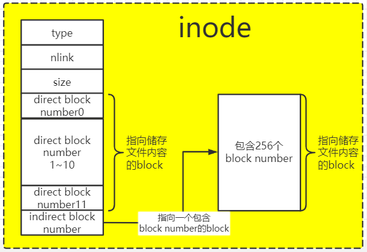

由此可算出一个文件的最大长度等于=（256+12）*1024bytes——一个block1024字节（不同文件系统不一样）


------

> 本lab将实现JOS的文件系统，包括如下四部分：
>
> 1. 引入一个**文件系统进程（FS进程）**的特殊进程，该进程提供文件操作的接口。
> 2. **建立RPC机制**，客户端进程向FS进程发送请求，FS进程真正执行文件操作，并将数据返回给客户端进程。
> 3. 更高级的抽象，引入**文件描述符**。通过文件描述符这一层抽象就可以将**控制台，pipe，普通文件**，统统按照文件来对待。（文件描述符和pipe实现原理）
> 4. 支持从磁盘**加载程序**并运行。


### Sectors and Blocks

大多数磁盘无法以字节粒度执行读取和写入，而是以*扇区*为单位执行读取和写入。 在 JOS 中，每个扇区为 512 字节。 文件系统实际上以**块**为单位分配和使用磁盘存储。请注意这两个术语之间的区别：**扇区大小**是磁盘硬件的属性， 而**块大小**是使用磁盘的操作系统的一个方面。 文件系统的块大小必须为基础磁盘扇区大小的倍数。

UNIX xv6 文件系统使用 512 字节的块大小，与基础磁盘的扇区大小相同。 但是，大多数现代文件系统使用更大的块大小， 因为存储空间变得便宜得多。而且，以更大的粒度管理存储会更有效。 我们的文件系统将使用4096字节的块大小，方便地匹配处理器的页面大小。

### Superblocks

文件系统通常保留磁盘上“易于查找”的位置 （例如最开始或最结束），以此来保存描述整个文件系统属性的元数据， 如块大小、磁盘大小、 查找根目录所需的任何元数据，上次挂载文件系统的时间，上次检查文件系统是否存在错误的时间，等等。 这些特殊块称为**超级块**

我们的文件系统将只有一个超级块， 它将始终位于磁盘上的块 1 处。 它的布局由 `inc/fs.h` 定义。 块 0 通常保留用于保存引导加载程序和分区表， 因此，文件系统通常不使用第一个磁盘块。 许多“真正的”文件系统维护多个超级块， 在磁盘的几个宽间距区域中复制， 这样，如果其中一个被损坏 或者磁盘在该区域出现介质错误， 其他超级块仍然可以找到并用于访问文件系统。

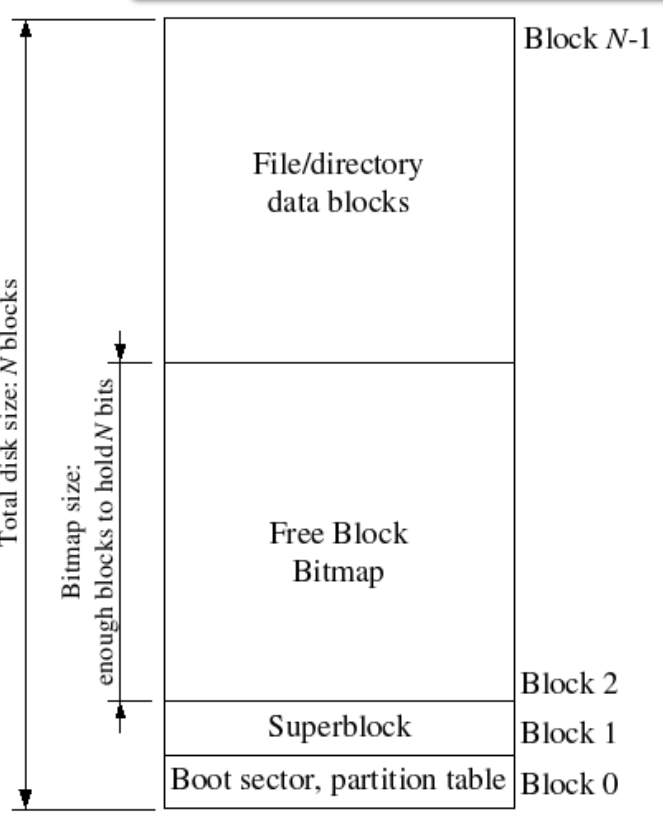


```c
struct Super {
	uint32_t s_magic;		// Magic number: FS_MAGIC
	uint32_t s_nblocks;		// Total number of blocks on disk
	struct File s_root;		// Root directory node
};
```

### File Meta-data

文件系统使用struct File结构描述文件，该结构包含文件名，大小，类型，保存文件内容的block号。struct File结构的f_direct数组保存前NDIRECT（10）个block号，这样对于10*4096=40KB的文件不需要额外的空间来记录内容block号。对于更大的文件我们分配一个额外的block来保存4096/4=1024 block号。所以我们的文件系统允许文件最多拥有1034个block，一个文件最大为4MB


```c
struct File {
	char f_name[MAXNAMELEN];	// filename
	off_t f_size;			// file size in bytes
	uint32_t f_type;		// file type

	// Block pointers.
	// A block is allocated iff its value is != 0.
	uint32_t f_direct[NDIRECT];	// direct blocks
	uint32_t f_indirect;		// indirect block

	// Pad out to 256 bytes; must do arithmetic in case we're compiling
	// fsformat on a 64-bit machine.
	uint8_t f_pad[256 - MAXNAMELEN - 8 - 4*NDIRECT - 4];
} __attribute__((packed));	// required only on some 64-bit machines
```


## Disk Access

操作系统中的文件系统环境需要能够访问磁盘，但是我们还没有在内核中实现任何磁盘访问功能。

我们使用一个文件系统进程来作为磁盘驱动，通过轮询而不是中断来实现在用户空间进行磁盘访问。而不是像其他操作提供系统调用。

在`kern/env.c`::`env_create()`中添加代码：

```c
	// If this is the file server (type == ENV_TYPE_FS) give it I/O privileges.
	// LAB 5: Your code here.
	if (type == ENV_TYPE_FS)
		e->env_tf.tf_eflags |= FL_IOPL_MASK;//给文件进程以IO权限
```

## The Block Cache

我们的文件系统将仅限于处理大小为 3GB 或更小的磁盘。 我们保留了一个大型固定的3GB区域文件系统环境的地址空间，从0x10000000（DISKMAP）最多0xD0000000（DISKMAP+DISKMAX），作为磁盘的“内存映射”版本。例如磁盘块0映射在虚拟地址0x10000000，磁盘块1映射在虚拟地址0x10001000，等等。

当然，将整个磁盘读取到内存需要很长时间，因此我们将实现一种**需求分页**的形式，其中我们只在磁盘映射区域中分配页面并读取来自磁盘的相应块，以响应此页面错误。这样，我们可以假设整个磁盘都在内存中。

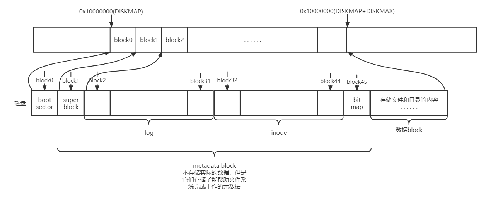

### `fs/bc.c`::`bc_pgfault(struct UTrapframe *utf)`：

**是FS进程缺页处理函数，负责将数据从磁盘读取到对应的内存。与普通进程缺页处理相同**

```c
static void
bc_pgfault(struct UTrapframe *utf)
{
	void *addr = (void *)utf->utf_fault_va;
	uint32_t blockno = ((uint32_t)addr - DISKMAP) / BLKSIZE;
	int r;

	// Check that the fault was within the block cache region
	if (addr < (void *)DISKMAP || addr >= (void *)(DISKMAP + DISKSIZE))
		panic("page fault in FS: eip %08x, va %08x, err %04x",
			  utf->utf_eip, addr, utf->utf_err);

	// Sanity check the block number.
	if (super && blockno >= super->s_nblocks)
		panic("reading non-existent block %08x\n", blockno);

	// Allocate a page in the disk map region, read the contents
	// of the block from the disk into that page.
	// Hint: first round addr to page boundary. fs/ide.c has code to read
	// the disk.
	//
	// LAB 5: you code here:
	addr = (void *)ROUNDDOWN(addr, PGSIZE);
    //为缺页的地址分配物理内存
	if ((r = sys_page_alloc(0, addr, PTE_P | PTE_W | PTE_U)) < 0)
		panic("bc_pgfault failed: sys_page_alloc: %e", r);
	//将磁盘数据读入addr指向的内存中
	if ((r = ide_read(blockno * BLKSECTS, addr, BLKSECTS)) < 0)
		panic("bc_pgfault failed: ide_read: %e", r);

    //因为我们已经重新读入了这个磁盘的内容，因此，dirty标志位需要清除，防止不必要的从内从中写入磁盘的操作。
	// Clear the dirty bit for the disk block page since we just read the
	// block from disk
	if ((r = sys_page_map(0, addr, 0, addr, uvpt[PGNUM(addr)] & PTE_SYSCALL)) < 0)
		panic("in bc_pgfault, sys_page_map: %e", r);

	// Check that the block we read was allocated. (exercise for
	// the reader: why do we do this *after* reading the block
	// in?)
	if (bitmap && block_is_free(blockno))
		panic("reading free block %08x\n", blockno);
}
```

### `fs/bc.c`::`flush_block(void *addr)`：

**将内存中addr地址上的数据写回磁盘，如果没有被映射或者不是脏块则直接return**

```c
void flush_block(void *addr)
{
	uint32_t blockno = ((uint32_t)addr - DISKMAP) / BLKSIZE;

	if (addr < (void *)DISKMAP || addr >= (void *)(DISKMAP + DISKSIZE))
		panic("flush_block of bad va %08x", addr);

	// LAB 5: Your code here.
	int r;
	addr = (void *)ROUNDDOWN(addr, PGSIZE);
	if (va_is_mapped(addr) && va_is_dirty(addr))
	{
		r = ide_write(blockno * BLKSECTS, addr, BLKSECTS);
		if (r < 0)
			panic("flush_block failed: ide_write: %e", r);
		if ((r = sys_page_map(0, addr, 0, addr, uvpt[PGNUM(addr)] & PTE_SYSCALL)) < 0)
			panic("flush_block failed: sys_page_map: %e", r);
	}

	// panic("flush_block not implemented");
}
```


## The Block Bitmap

bitmap：将磁盘上的每个块用一位来记录是否使用

`fs/fs.c`::`alloc_block(void)`：

**搜索bitmap，找到一个free block然后分配它，并及时刷新bitmap block**

```c
int alloc_block(void)
{
	// The bitmap consists of one or more blocks.  A single bitmap block
	// contains the in-use bits for BLKBITSIZE blocks.  There are
	// super->s_nblocks blocks in the disk altogether.

	// LAB 5: Your code here.
	uint32_t blockno;
    //block 0是保留的，可能作为boot sector
	for (blockno = 1; blockno < super->s_nblocks; ++blockno)
	{
		if (block_is_free(blockno))
		{
			bitmap[blockno / 32] &= ~(1 << (blockno % 32));
			flush_block(&bitmap[blockno / 32]);
			return blockno;
		}
	}
	// panic("alloc_block not implemented");
	return -E_NO_DISK;
}
```

## File Operations

基本的文件系统操作`fs/fs.c`：

### `file_block_walk(struct File *f, uint32_t filebno, uint32_t **ppdiskbno, bool alloc)`：

**查找文件f中的第filebno个指向磁盘的块，并将此块的编号放入ppdiskbno中，如果alloc为真，且indirect block没有被分配，则分配一个新的block作为indirect block**

```c
static int
file_block_walk(struct File *f, uint32_t filebno, uint32_t **ppdiskbno, bool alloc)
{
	// LAB 5: Your code here.
    //一个文件结构最多只能用NDIRECT+NINDIRECT个block来记录数据
	if (filebno >= NDIRECT + NINDIRECT)
		return -E_INVAL;
	uint32_t *indirects;
	int bno;
	if (filebno < NDIRECT)
	{
		if (ppdiskbno)
			*ppdiskbno = f->f_direct + filebno;
		return 0;
	}
	else
	{
		if (f->f_indirect)
		{
			indirects = diskaddr(f->f_indirect);
		}
		else
		{
			if (!alloc)
				return -E_NOT_FOUND;
			if ((bno = alloc_block()) < 0)
				return bno;
			f->f_indirect = bno;
			memset(diskaddr(bno), 0, BLKSIZE);
			flush_block(diskaddr(bno));
			indirects = diskaddr(bno);
		}
		if (ppdiskbno)
			*ppdiskbno = &(indirects[filebno - NDIRECT]);
	}
	return 0;
	// panic("file_block_walk not implemented");
}
```

### `file_get_block(struct File *f, uint32_t filebno, char **blk)`：

**将文件f中的第filebno个block的虚拟地址存到*blk中**

```c
int file_get_block(struct File *f, uint32_t filebno, char **blk)
{
	// LAB 5: Your code here.
	uint32_t *ppdiskbno;
	int ret = file_block_walk(f, filebno, &ppdiskbno, 1);
	if (ret < 0)
		return ret;
	int bno;
	if (*ppdiskbno == 0)
	{
		if ((bno = alloc_block()) < 0)
			return bno;
		*ppdiskbno = bno;
		memset(diskaddr(bno), 0, BLKSIZE);
		flush_block(diskaddr(bno));
	}
	*blk = diskaddr(*ppdiskbno);
	return 0;

	// panic("file_get_block not implemented");
}
```

#### `dir_lookup(struct File *dir, const char *name, struct File **file)`：

**在dir中查找一个文件名为name的文件，并保存在*file中。**

**采用的是轮询查找，并比较文件名**

#### `dir_alloc_file(struct File *dir, struct File **file)`：

**在dir寻找一个空的file结构，将其地址保存在*flie中**

#### `walk_path(const char *path, struct File **pdir, struct File **pf, char *lastelem)`：

**解析字符串path，比如：/root/home/fs.c，将home文件夹放入pdir，将fs.c放入pf，lastelem存的是fs.c字符串**

文件操作：

#### `file_create(const char *path, struct File **pf)`：

**创建path，如果创建成功，则将其保存在*pf中**

#### `file_open(const char *path, struct File **pf)`：

**打开path对应的文件，并保存在*pf中**

#### `file_read(struct File *f, void *buf, size_t count, off_t offset)`：

**从文件f的offset位置开始，读取count个字节到buf中**

#### `file_write(struct File *f, const void *buf, size_t count, off_t offset)`：

**将buf中的count字节写入文件f的offset位置**


## The file system interface

现在，在文件系统环境中，已经有必要的功能了，但是还需要提供其他进程对文件系统的访问接口。

**RPC: Remote Procedure Call** 

通过网络从远程计算机程序上请求服务，而不需要了解底层网络技术的协议。RPC协议假定某些传输协议的存在，如TCP或UDP，为通信程序之间携带信息数据。在OSI网络通信模型中，RPC跨越了传输层和应用层。RPC使得开发包括网络分布式多程序在内的应用程序更加容易。

本质上RPC还是借助IPC机制实现的，普通进程通过IPC向FS进程间发送具体操作和操作数据，然后FS进程执行文件操作，最后又将结果通过IPC返回给普通进程。

```assembly
 Regular env           FS env
   +---------------+   +---------------+
   |      read     |   |   file_read   |
   |   (lib/fd.c)  |   |   (fs/fs.c)   |
...|.......|.......|...|.......^.......|...............
   |       v       |   |       |       | RPC mechanism
   |  devfile_read |   |  serve_read   |
   |  (lib/file.c) |   |  (fs/serv.c)  |
   |       |       |   |       ^       |
   |       v       |   |       |       |
   |     fsipc     |   |     serve     |
   |  (lib/file.c) |   |  (fs/serv.c)  |
   |       |       |   |       ^       |
   |       v       |   |       |       |
   |   ipc_send    |   |   ipc_recv    |
   |       |       |   |       ^       |
   +-------|-------+   +-------|-------+
           |                   |
           +-------------------+
```

在虚线下的部分是普通进程如何发送一个读请求到文件系统服务进程的机制。首先read操作文件描述符，分发给合适的设备读函数devfile_read 。devfile_read函数实现读取磁盘文件，作为客户端文件操作函数。然后建立请求结构的参数，调用fsipc函数来发送IPC请求并解析返回的结果。

文件系统服务端代码位于`fs/serv.c`中，`serve()`函数无限循环，接收IPC请求，并将对应的请求分配到对应的处理函数，然后将处理结果通过IPC发送回去。

文件系统中，每个打开的文件有三个结构：

1. `struct file`，主要是从磁盘映射到内存的一种结构，文件系统不能直接访问

   ```c
   struct File {
   	char f_name[MAXNAMELEN];	// filename
   	off_t f_size;			// file size in bytes
   	uint32_t f_type;		// file type
   
   	// Block pointers.
   	// A block is allocated iff its value is != 0.
   	uint32_t f_direct[NDIRECT];	// direct blocks
   	uint32_t f_indirect;		// indirect block
   
   	// Pad out to 256 bytes; must do arithmetic in case we're compiling
   	// fsformat on a 64-bit machine.
   	uint8_t f_pad[256 - MAXNAMELEN - 8 - 4*NDIRECT - 4];
   } __attribute__((packed));	// required only on some 64-bit machines
   ```

2. `struct Fd`，文件描述符，它是所有类型文件的一种抽象，用户使用的就是Fd，其可以指代真是文件、Socket、管道等等。此lab中，只使用文件，所以union中只有一个FDFile

   ```c
   struct Fd {
   	int fd_dev_id;
   	off_t fd_offset;
   	int fd_omode;
   	union {
   		// File server files
   		struct FdFile fd_file;
   	};
   };
   ```

3. `struct OpenFile`，将一个真实文件struct File和用户客户端打开的文件描述符struct Fd对应到一起，服务端使用了一个OpenFile数组，最多有MAXOPEN个OpenFile。客户端使用file ID与服务端通信

   ```c
   struct OpenFile
   {
   	uint32_t o_fileid;	 // file id
   	struct File *o_file; // mapped descriptor for open file
   	int o_mode;			 // open mode
   	struct Fd *o_fd;	 // Fd page
   };
   ```


### `fs/serv.c`::`serve_read(envid_t envid, union Fsipc *ipc)`：

**向文件系统进行read请求，主要调用底层的`file_read`来实现**

**从ipc->read.req_fileid中读ipc->read>req_n个字节，将其写入ipc->readRet中**

```c
int serve_read(envid_t envid, union Fsipc *ipc)
{
	struct Fsreq_read *req = &ipc->read;
	struct Fsret_read *ret = &ipc->readRet;

	if (debug)
		cprintf("serve_read %08x %08x %08x\n", envid, req->req_fileid, req->req_n);

	// Lab 5: Your code here:
	struct OpenFile *of;
	int r;
	if ((r = openfile_lookup(envid, req->req_fileid, &of)) < 0)
		return r;
	if ((r = file_read(of->o_file, ret->ret_buf, req->req_n, of->o_fd->fd_offset)) < 0)
		return r;
	of->o_fd->fd_offset += r;
	return r;
}
```


### `fs/serv.c`::`serve_write(envid_t envid, struct Fsreq_write *req)`：

**向文件系统进行write请求，主要调用底层的`file_write`来实现**

**从req_buf向req_fileid中写入req->req_n个字节**

```c
int serve_write(envid_t envid, struct Fsreq_write *req)
{
	if (debug)
		cprintf("serve_write %08x %08x %08x\n", envid, req->req_fileid, req->req_n);

	// LAB 5: Your code here.
	struct OpenFile *of;
	int r;
	if ((r = openfile_lookup(envid, req->req_fileid, &of)) < 0)
		return r;
	if ((r = file_write(of->o_file, req->req_buf, req->req_n, of->o_fd->fd_offset)) < 0)
		return r;
	of->o_fd->fd_offset += r;
	return r;
	// panic("serve_write not implemented");
}
```


### `lib/file.c`::`devfile_write(struct Fd *fd, const void *buf, size_t n)`：

**客户端进程函数，可以参考devfile_read，直接调用fsipc()将参数发送给fs进程处理**

```c
static ssize_t
devfile_write(struct Fd *fd, const void *buf, size_t n)
{
	// Make an FSREQ_WRITE request to the file system server.  Be
	// careful: fsipcbuf.write.req_buf is only so large, but
	// remember that write is always allowed to write *fewer*
	// bytes than requested.
	// LAB 5: Your code here
	int r;
	if (n > sizeof(fsipcbuf.write.req_buf))
		n = sizeof(fsipcbuf.write.req_buf);
	fsipcbuf.write.req_fileid = fd->fd_file.id;
	fsipcbuf.write.req_n = n;
	memmove(fsipcbuf.write.req_buf, buf, n);
	return fsipc(FSREQ_WRITE, NULL);
	// panic("devfile_write not implemented");
}
```


## Spawning Processes

`lib/spawn.c`中的`spawn()`将用户程序从文件系统加载进来，并创建一个新的进程来运行这个程序。`spawn()`的作用与UNIX中的`fork()`后面马上跟着`exec()`相同。

### `kern/syscall.c`::`sys_env_set_trapframe(envid_t envid, struct Trapframe *tf)`：

**将envid的trapframe设置为tf**

```c
static int
sys_env_set_trapframe(envid_t envid, struct Trapframe *tf)
{
	// LAB 5: Your code here.
	// Remember to check whether the user has supplied us with a good
	// address!
	struct Env *e;
	int ret = envid2env(envid, &e, 1);
	if (ret < 0)
		return ret;
	user_mem_assert(e, tf, sizeof(struct Trapframe), PTE_U);
	e->env_tf = *tf;
	e->env_tf.tf_cs |= 3;
	e->env_tf.tf_eflags &= (~FL_IOPL_MASK);
	e->env_tf.tf_eflags |= FL_IF;
	return 0;
	// panic("sys_env_set_trapframe not implemented");
}

//还要在syscall函数中调用
case SYS_env_set_trapframe:
		return sys_env_set_trapframe((envid_t)a1, (struct Trapframe *)a2);
```


## Sharing library state across fork and spawn

UNIX文件描述符是一个一般的概念，包括管道、控制台 I/O 等。在JOS中，这些设备中的每一个类型具有相应的`struct Dev` ，该结构带有指向实现函数的指针，其指向该设备类型的read/write等。`lib/fd.c`中实现了UNIX文件描述符接口。

在`lib/fd.c`中，为每个进程维护了文件描述符表，从`FSTABLE`开始，为每个描述符保留了1页的地址空间。当且仅当文件描述符在使用中时，映射特定文件描述符表页。

我们希望在调用`fork`和`spawn`来创建新进程时，能够共享文件描述符状态。目前，调用fork函数只能使用COW位，从而是将状态复制一份，而不是共享。在spawn中，更不会被复制，而是直接丢弃。

因此，我们在`inc/lib.h`中，新定义了一个`PTE_SHARE`标志位来表示页共享。当存在该标志位时，fork和spawn函数应该从父进程中拷贝PTE到子进程中。

### `lib/fork.c`::`duppage(envid_t envid, unsigned pn)`：

**在duppage中添加一个if语句来检查PTE_SHARE标志位**

**PTE_SHARE和PTE_COW都是将父进程的映射关系拷贝到子进程中，但之后的行为是不同的。PTE_SHARE是共享，其中一个进程修改，则直接修改其内容，另一个进程也会改变。            PTE_COW是写时复制，其中一个进程修改，会先复制出来，再修改，另一个进程不受影响**

```c
static int
duppage(envid_t envid, unsigned pn)
{
	int r;

	// LAB 4: Your code here.
	void *addr = (void *)(pn * PGSIZE);
	if (uvpt[pn] & PTE_SHARE)
	{
		if ((r = sys_page_map(0, addr, envid, addr, uvpt[pn] & PTE_SYSCALL)) < 0)
			return r;
	}
	else if ((uvpt[pn] & PTE_W) || (uvpt[pn] & PTE_COW))
	{
		if ((r = sys_page_map(0, addr, envid, addr, PTE_P | PTE_U | PTE_COW)) < 0)
			return r;
		if ((r = sys_page_map(0, addr, 0, addr, PTE_P | PTE_U | PTE_COW)) < 0)
			return r;
	}
	else if ((r = sys_page_map(0, addr, envid, addr, PTE_P | PTE_U)) < 0)
		return r;
	// panic("duppage not implemented");
	return 0;
}
```

### `lib/spawn.c`::`copy_shared_pages(envid_t child)`：

**复制共享页的映射到子进程中**

```c
static int
copy_shared_pages(envid_t child)
{
	// LAB 5: Your code here.
	int r, pn;
	struct Env *e;
    //遍历进程页表所有PTE，将设置了PTE_SHARE的页映射到子进程中
	for (pn = PGNUM(UTEXT); pn < PGNUM(USTACKTOP); ++pn)
	{
		if ((uvpd[pn >> 10] & PTE_P) && (uvpt[pn] & PTE_P))
		{
			if (uvpt[pn] & PTE_SHARE)
			{
				if ((r = sys_page_map(0, (void *)(pn * PGSIZE),
									  child, (void *)(pn * PGSIZE),
									  uvpt[pn] & PTE_SYSCALL)) < 0)
					return r;
			}
		}
	}
	return 0;
}
```


# The keyboard interface

键盘中断和串口中断的实现，从而shell可正常工作。

在`kern/trap.c`中调用`kbd_intr()`来处理`IRQ_OFFSET + IRQ_KBD`，调用`serial_intr()`来处理`IRQ_OFFSET + IRQ_SERIAL`：

```c
// Handle keyboard and serial interrupts.
	// LAB 5: Your code here.
	if (tf->tf_trapno == IRQ_OFFSET + IRQ_KBD)
	{
		kbd_intr();
		return;
	}
	if (tf->tf_trapno == IRQ_OFFSET + IRQ_SERIAL)
	{
		serial_intr();
		return;
	}
```


## The Shell

运行`user/icode.c`，它会调用`spawnl`函数来运行`init`进程，将console当作输入输出文件描述符，然后运行`spawn`创建出shell

目前，shell不支持I/O重定向，在`user/sh.c`中增加该功能：

```c
case '<': // Input redirection
			// Grab the filename from the argument list
			if (gettoken(0, &t) != 'w')
			{
				cprintf("syntax error: < not followed by word\n");
				exit();
			}
			// Open 't' for reading as file descriptor 0
			// (which environments use as standard input).
			// We can't open a file onto a particular descriptor,
			// so open the file as 'fd',
			// then check whether 'fd' is 0.
			// If not, dup 'fd' onto file descriptor 0,
			// then close the original 'fd'.

			// LAB 5: Your code here.
			if ((fd = open(t, O_RDONLY)) < 0)
			{
				fprintf(2, "file %s is no exist\n", t);
				exit();
			}
			if (fd != 0)
			{
				dup(fd, 0);
				close(fd);
			}
			// panic("< redirection not implemented");
			break;
```


# 参考文章：

[MIT-6.828-JOS-lab5:File system, Spawn and Shell - gatsby123 - 博客园 (cnblogs.com)](https://www.cnblogs.com/gatsby123/p/9950705.html)

[MIT6.828 Lab 5: File system, Spawn and Shell_bysui的博客-CSDN博客](https://blog.csdn.net/bysui/article/details/51868917?spm=1001.2014.3001.5502)

